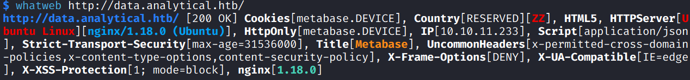
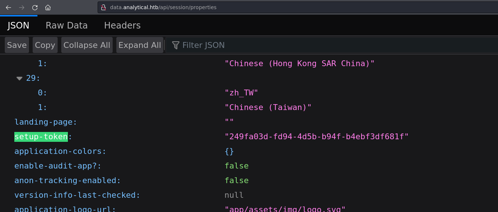
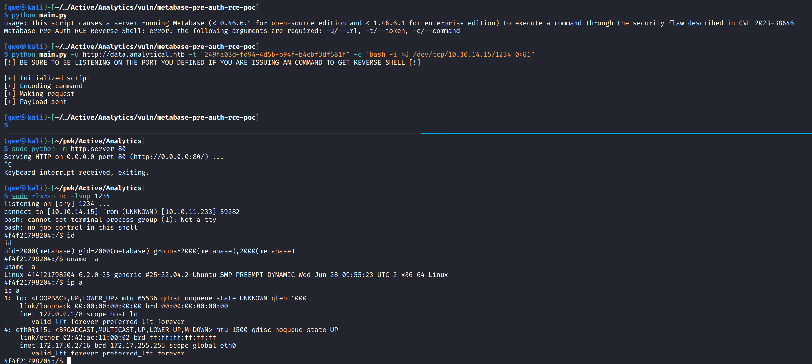
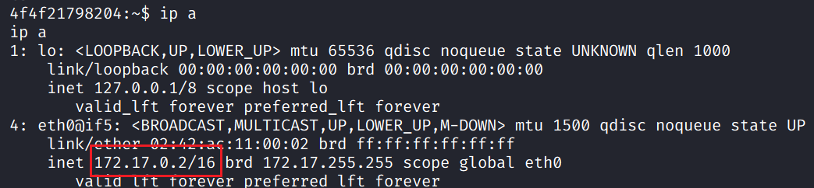
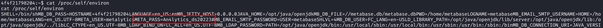
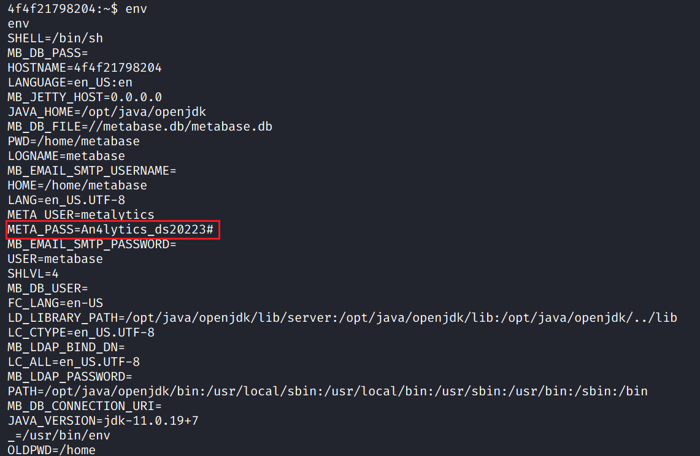
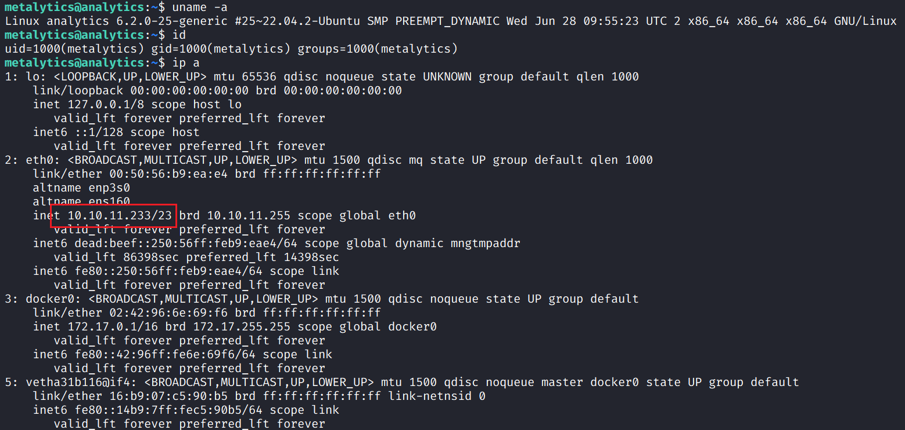
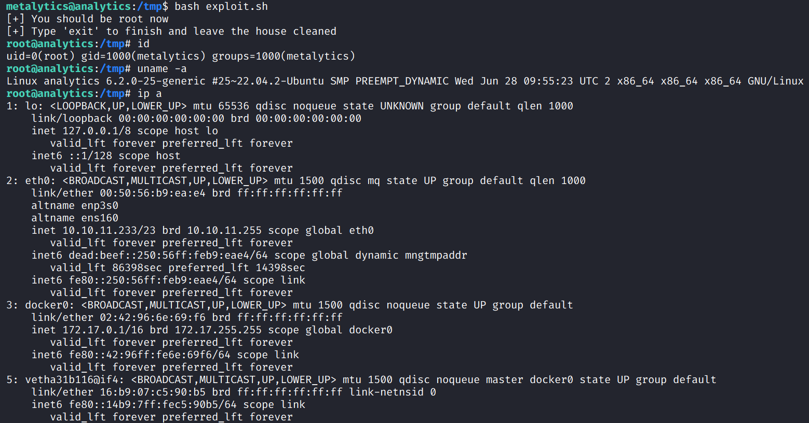

## Machine Info


## Recon

```
PORT   STATE SERVICE VERSION
22/tcp open  ssh     OpenSSH 8.9p1 Ubuntu 3ubuntu0.4 (Ubuntu Linux; protocol 2.0)
| ssh-hostkey:
|   256 3e:ea:45:4b:c5:d1:6d:6f:e2:d4:d1:3b:0a:3d:a9:4f (ECDSA)
|_  256 64:cc:75:de:4a:e6:a5:b4:73:eb:3f:1b:cf:b4:e3:94 (ED25519)
80/tcp open  http    nginx 1.18.0 (Ubuntu)
|_http-server-header: nginx/1.18.0 (Ubuntu)
|_http-title: Did not follow redirect to http://analytical.htb/
Warning: OSScan results may be unreliable because we could not find at least 1 open and 1 closed port
Aggressive OS guesses: Linux 5.0 (96%), Linux 4.15 - 5.8 (96%), Linux 5.3 - 5.4 (95%), Linux 2.6.32 (95%), Linux 5.0 - 5.5 (95%), Linux 3.1 (95%), Linux 3.2 (95%), AXIS 210A or 211 Network Camera (Linux 2.6.17) (95%), ASUS RT-N56U WAP (Linux 3.4) (93%), Linux 3.16 (93%)
No exact OS matches for host (test conditions non-ideal).
Network Distance: 2 hops
Service Info: OS: Linux; CPE: cpe:/o:linux:linux_kernel
```

- OS: Ubuntu 22.04 Jammy
- Domain: [http://analytical.htb/](http://data.analytical.htb/), http://data.analytical.htb/
- Path and subdomain: nothing
- whatweb



## Foothold

### CVE-2023-38646

**Detail**: Metabase Pre-Auth RCE

- [https://github.com/shamo0/CVE-2023-38646-PoC](https://github.com/shamo0/CVE-2023-38646-PoC?source=post_page-----866220684396--------------------------------)

- https://github.com/m3m0o/metabase-pre-auth-rce-poc
- `setup-token` checking



- get a shell



## Privilege Escalation

### container -> user priv

- check ip address -> this is inside a container



- check contrainer's environment to obtain USER and PASS: **metalytics:An4lytics_ds20223#**





- **ssh** to conn metalytics



### metalytics -> root

- enum: `uname -a` kernel version 6.2.0 and recon info: Ubuntu 22.04 Jammy -> GameOver Ubuntu Privilege Escalation: **CVE-2023-2640** + **CVE-2023-32629**
- [g1vi/CVE-2023-2640-CVE-2023-32629: GameOver(lay) Ubuntu Privilege Escalation (github.com)](https://github.com/g1vi/CVE-2023-2640-CVE-2023-32629)



## Exploit Chain

Metabase Pre-Auth RCE -> get a container shell -> user cred -> get a user shell -> GameOver(lay) priv esca -> root shell
