## Machine Info

## Recon

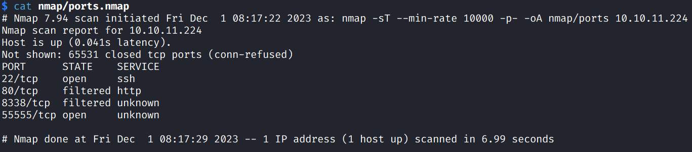

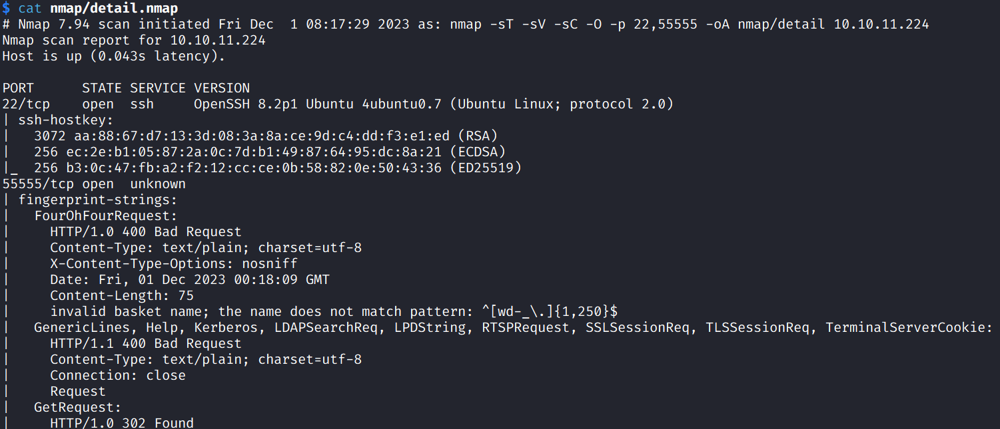

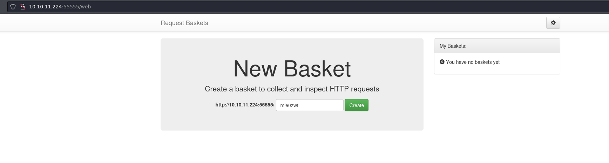

- open source repo: https://github.com/darklynx/request-baskets, Version: **1.2.1**

## Foothold

### explore 2 vulnerable services

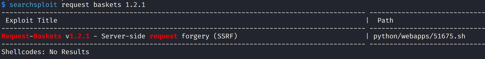

- POC: SSRF Vuln [y]

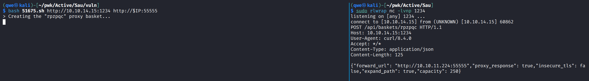

- new a brasket -> forward this site to another site 127.0.0.1:**80** (filtered port)

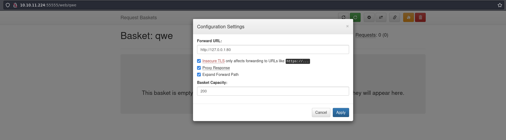

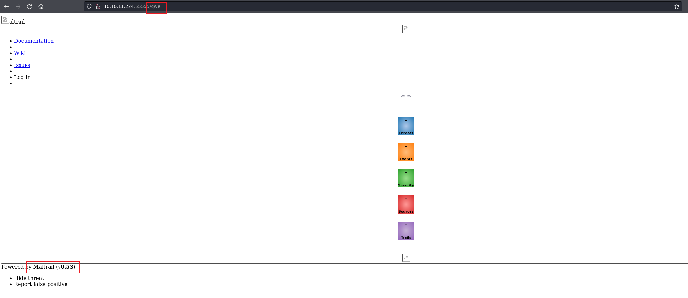

- 80 port's service: **Maltail 0.53**; 

- **vuln**: the `username` parameter of the login page doesn't properly sanitize the input, allowing an attacker to inject OS commands

- [spookier/Maltrail-v0.53-Exploit: RCE Exploit For Maltrail-v0.53 (github.com)](https://github.com/spookier/Maltrail-v0.53-Exploit/tree/main)

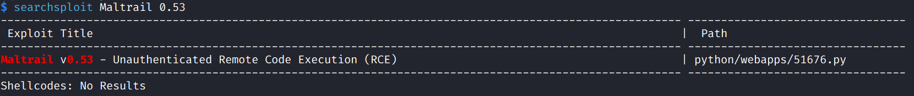

### combine them together to get user shell

- [zhsh9/Request-Baskets-v1.2.1-Trigger-Maltrail-v0.53-Exploit: HTB Sau POC: RCE exploit for Maltrail v0.53 triggered by Request Baskets v1.2.1 (github.com)](https://github.com/zhsh9/Request-Baskets-v1.2.1-Trigger-Maltrail-v0.53-Exploit)

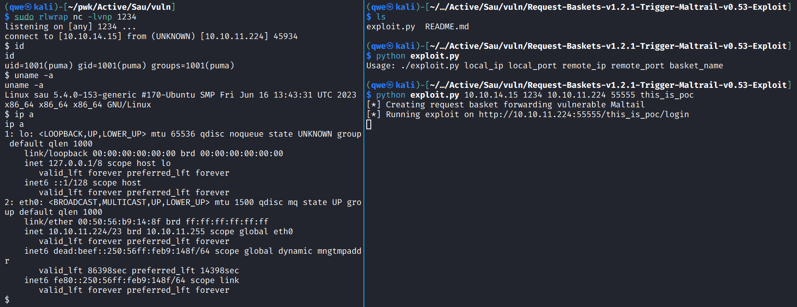

## Privilege Escalation

- `sudo -l` -> systemctrl sudo -> less-like -> !sh

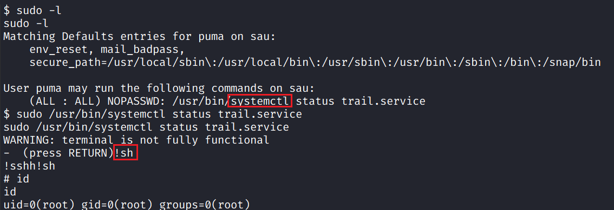

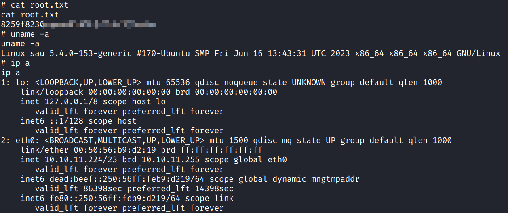

## Exploit Chain

SSRF -> forward 80 serice -> RCE -> get user shell -> sudo systemctl -> get root shell
