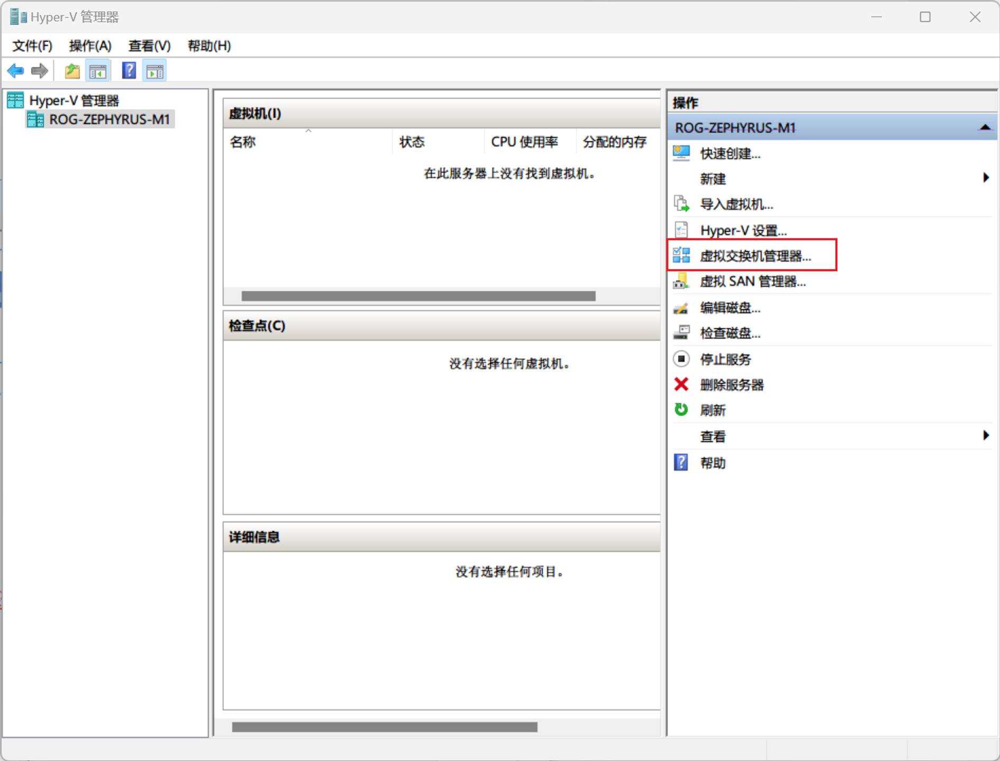
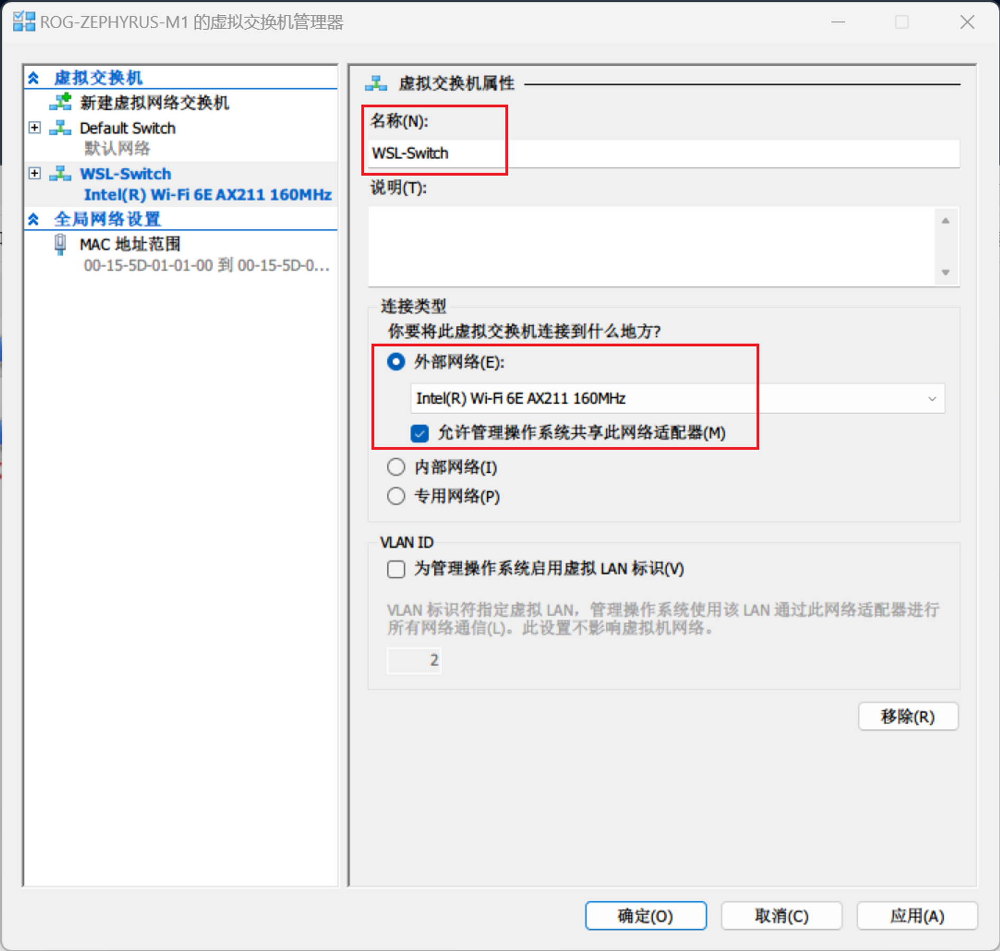
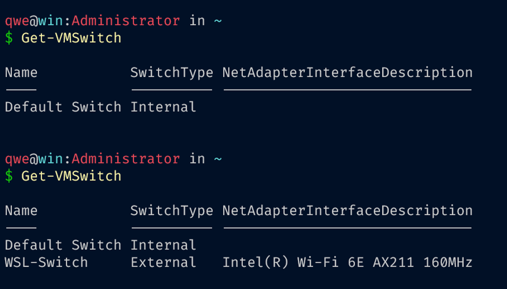

## ENV

- wsl2 - kali linux
- vmware workstation - machines

## Network

all connect to WLAN

- wsl2

```bash
# on win
Get-NetAdapter
Set-VMSwitch WSL -NetAdapterName WLAN

# on kali
sudo ip addr del $(ip addr show eth0 | grep 'inet\b' | awk '{print $2}' | head -n 1) dev eth0
sudo ip addr add 192.168.1.99/24 broadcast 192.168.1.255 dev eth0
sudo ip route add 0.0.0.0/0 via 192.168.1.1 dev eth0
```

- vmware machine: bridge mode (a hyper-v virtual switch)

## create hyper-v virtual switch







## wsl2 bridge config

instead of changing ip addr using ip command, change config file of wsl2 on windows:

```
[wsl2]
processors=4
memory=8GB
swap=0

[wsl2]
networkingMode=bridged
vmSwitch=WSL-Switch
ipv6=true
```